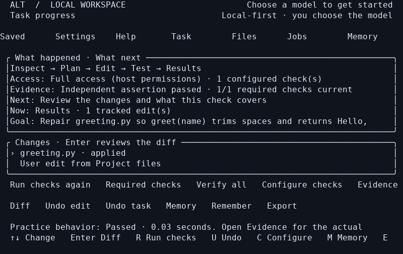

# Alt

[](https://github.com/3d3dcanada/alt-cli/actions/workflows/verify.yml)
[](LICENSE)

**A Rust terminal workspace for building, inspecting and testing software with your own models.**

Alt combines a terminal UI, project files, real shell sessions, model management,
persistent project memory and checkable task results. Choose your model and access
mode, describe what you want, and inspect what actually changed. It is designed
for local models and people who prefer labelled choices to configuration files.

Alt supports compatible uncensored, abliterated and Heretic models through GGUF
or server connections. It does not modify model weights or silently replace your
selected model. Full access supports arbitrary commands, networking, package
installation and external tools with your normal account permissions.



**Status: 0.6.0 beta · Linux x86_64 · Apache-2.0.** The screenshot shows the actual
0.6 practice workflow after a manual edit and four behavioral checks. Model reliability and hardware support are measured separately from
application tests. [Read the results and remaining gaps](docs/IMPLEMENTATION.md).

## Try it on your computer

Find versioned Linux packages on [GitHub Releases](https://github.com/3d3dcanada/alt-cli/releases). See [Installation](docs/INSTALLATION.md) for archive and GitHub provenance verification, or build from source below.

Install [Rust with rustup](https://rustup.rs/), Git and a C compiler first. On
Debian/Ubuntu, the usual prerequisites are `git build-essential pkg-config curl
ca-certificates python3 libgomp1`. The repository selects Rust 1.99.0 automatically.

```bash
git clone https://github.com/3d3dcanada/alt-cli.git
cd alt-cli
cargo build --locked --release
./target/release/alt
```

Home opens without a model. Building the application does not download weights.
For step-by-step prerequisites, installing an `alt` command, CI packages and
updates, see **[Installation](docs/INSTALLATION.md)**. Use a real terminal; on a
small computer, `CARGO_BUILD_JOBS=2 cargo build --locked --release` reduces build
parallelism.

1. **Try a practice project** from Home to learn checks, edits and undo, or choose your own project folder.
2. **Connect a model** you already run in Ollama, LM Studio or another compatible
   server, or import/download a GGUF from Models.
3. **Install the agent engine** when Home offers it. A managed GGUF also needs
   the optional local runtime. Existing executables can be selected in Settings.
4. **Choose access in Settings**, then describe the change or investigation.
5. **Prepare project checks** on Home, then open Task to inspect edits and actual evidence.
   A model saying “done” does not mark the behavior verified.

## What you can do

| Area | Included |
|---|---|
| Models | Hugging Face search, verified/resumable downloads, multipart GGUF, imported files and server model selection |
| Coding workspace | Browse/search/edit files, inspect diffs, checkpoint Alt edits, undo and resume conversations |
| Terminal | Real PTY sessions, interactive input, resize, attach/detach, persistent jobs, stop/restart and health checks |
| Tools | Native project tools; optional build, Git, HTTP, browser and security workflows; selected external MCP tools |
| Project memory | Saved goals and decisions, pinned notes, incremental source indexing, retrieved context and a visible Context page |
| Verification | Tests/build/lint/health/custom contracts, structured reports, independently pinned assertions and stale-result detection |
| Runtime controls | Context, CPU threads, GPU layers, batch/cache settings, optional reasoning control, generation and restart qualification |
| Recovery | State backup/restore, history retention, preserved imported weights, diagnostics and package rollback |

**Full access** uses normal host permissions. **Guided changes** reviews edits and
uses Bubblewrap for isolated checks; it reports unavailable isolation instead of
silently running on the host. **Review only** is also available. File checkpoints
cover Alt edits; they do not undo arbitrary terminal, database or remote effects.
Tool focus is a separate explicit choice; **All** is the default.

## Models and older computers

| Connection | Address or input | Notes |
|---|---|---|
| Ollama | `http://127.0.0.1:11434` | Use the server root; configure its native context separately |
| LM Studio | Usually `http://127.0.0.1:1234/v1` | Load a model and start its compatible server first |
| llama.cpp / ORA / other compatible servers | The server's OpenAI-compatible `/v1` address | Tool behavior depends on the model and chat template |
| Managed local inference | A compatible GGUF file or complete split set | The pinned download is CPU first; GPU runtime selection is explicit |

The reference target is **Linux, 16 GB RAM and a GTX 1070 with 8 GB VRAM**. Physical
GTX 1070 performance has not been measured. Start conservatively with a small
quantized model and 4K–8K context, then measure your exact configuration. More
context needs additional memory; project retrieval cannot enlarge a model's
native context window. Pascal GPUs need a compatible CUDA 12 runtime, not a
CUDA 13-only build. CPU mode remains available.

The Hub's variant filter uses publisher labels, not a quality certification.
Qwen Heretic, Spark-X2.5 abliterated and MiMo Heretic derivatives have exploratory
results in the project. The complete 0.6 CPU matrices passed **7/120** pinned
behavioral checks for Spark and **16/120** for Qwen. Manual review and additional
edge cases found unsupported claims and incomplete repairs even among passes.
These are different model/budget configurations, not a matched comparison.
No model preset is promoted. Real LM Studio, private Hub acquisition and GPU
qualification remain open acceptance gates. See [model/runtime qualification](docs/QUALIFICATION.md)
and [live evaluations](docs/LIVE_EVALUATION.md).

## Keyboard and command line

| Action | Control |
|---|---|
| Navigate | Alt+1…9; Alt+0 opens Jobs; Ctrl+P lists every page |
| Help / quick actions | F1 / Ctrl+P |
| Send / newline | Enter / Alt+Enter or Ctrl+J |
| New conversation / project brief | Ctrl+N / Ctrl+B |
| Stop work / quit | Esc / Ctrl+Q |
| Detach from an attached terminal | Ctrl+] |

```bash
alt --help
alt practice
alt doctor
alt hardware
alt models search 'Qwen3 4B heretic'
alt models import /path/to/model.gguf --uncensored --use
alt run 'Inspect this project and explain its test commands'
alt --access trusted run 'Run this project’s checks' --allow-tools --json
alt state backup /path/outside-alt-state/backup.tar.gz
```

[`docs/CLI.md`](docs/CLI.md) covers setup, headless execution, jobs, verification
and export. State defaults to `$XDG_DATA_HOME/alt-cli` or
`~/.local/share/alt-cli`; use `--data-dir` or `ALT_DATA_DIR` to choose another folder.
Keys are referenced by environment-variable name, not saved in model profiles.

## Documentation

- [Installation and updates](docs/INSTALLATION.md) · [Troubleshooting](docs/TROUBLESHOOTING.md)
- [Workspace guide](docs/WORKSPACE_GUIDE.md) · [CLI reference](docs/CLI.md)
- [Verification contracts](docs/VERIFICATION_CONTRACTS.md) · [Runtime qualification](docs/QUALIFICATION.md)
- [Architecture](docs/ARCHITECTURE.md) · [Contributing](CONTRIBUTING.md) · [Changelog](CHANGELOG.md)
- [Implementation and evidence](docs/IMPLEMENTATION.md) · [Current work orders](docs/WORK_ORDERS_0.6.md) · [PC test guide](docs/PC_TESTING.md)
- [Research and project history](docs/research/README.md) · [Documentation index](docs/README.md)

Current validation includes **93 Rust tests**, five PTY walkthroughs, 30
responsiveness journeys, 60 stream-recovery scenarios and packaged
install/update/rollback checks on Debian 11 and Ubuntu 24.04. The local PC recorder
also passed a live uncensored-model CPU trial. These measurements do not guarantee
that a model can solve an arbitrary task. The [current evidence](docs/evidence/v6/README.md)
separates application results, model outcomes and remaining human/hardware checks.

## Development and license

```bash
cargo test --locked
cargo fmt --all --check
cargo clippy --locked --all-targets -- -D warnings
```

See [Contributing](CONTRIBUTING.md) for terminal tests, optional tools and the
cloud setup. CI builds and tests a Linux package; successful runs expose a
`linux-build-and-evidence` artifact in [GitHub Actions](https://github.com/3d3dcanada/alt-cli/actions).
Git does not include prebuilt binaries or model weights.

Alt's Rust interface is original project code using a separately installed,
replaceable [Goose ACP engine](https://github.com/aaif-goose/goose). It is not an
OpenCode fork. Alt is licensed under [Apache-2.0](LICENSE); upstream components
and models keep their own licenses. [Third-party provenance](THIRD_PARTY.md)
records versions, attribution and distribution boundaries.
