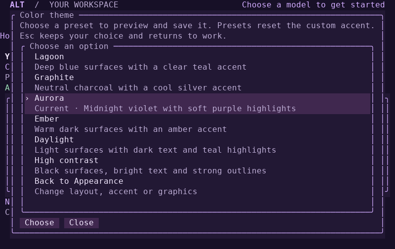
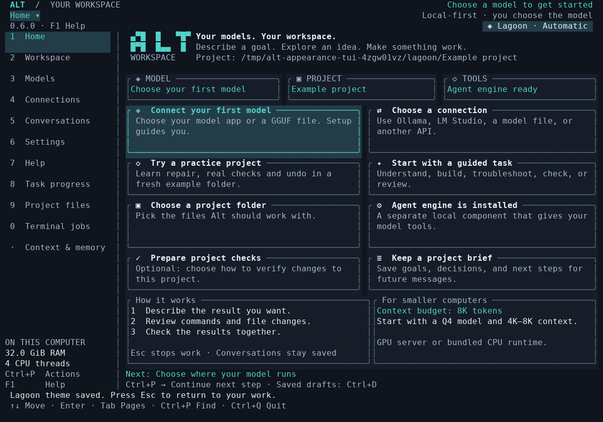
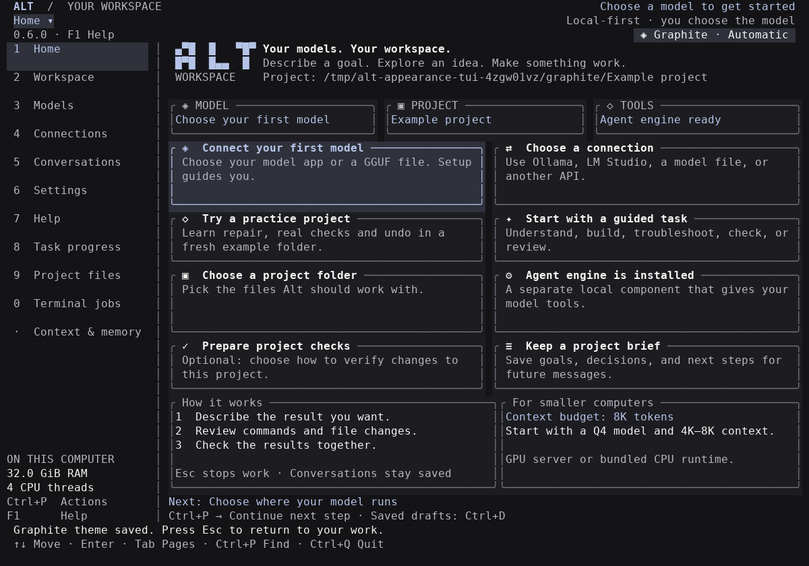
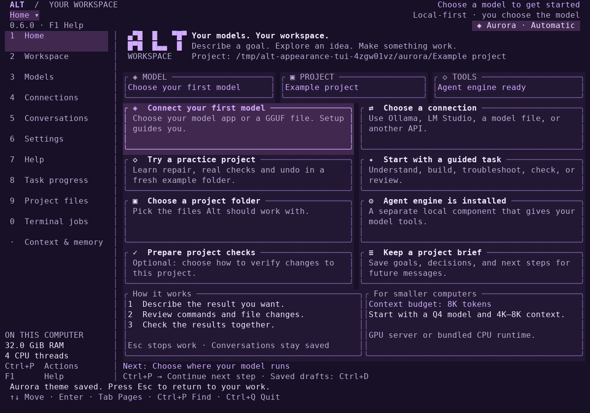
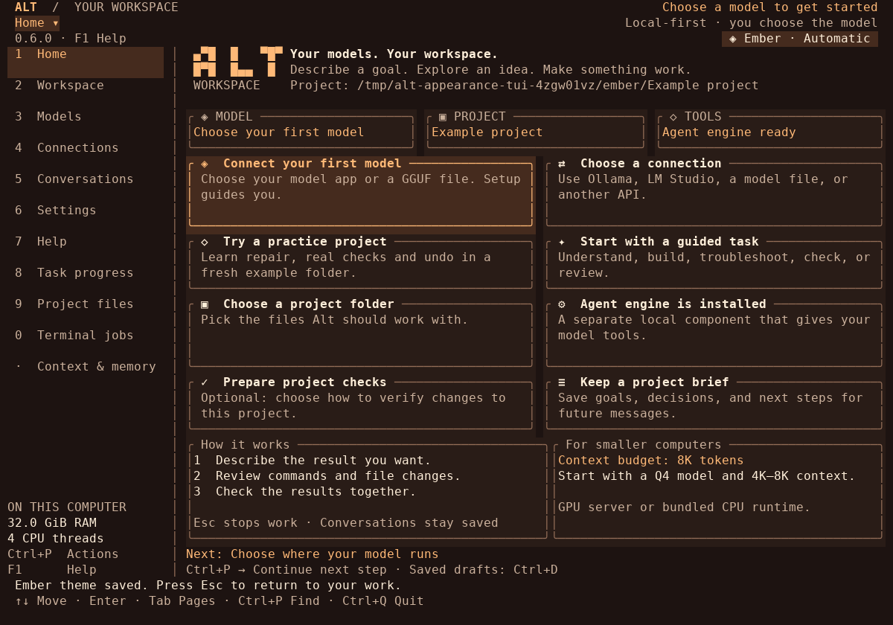
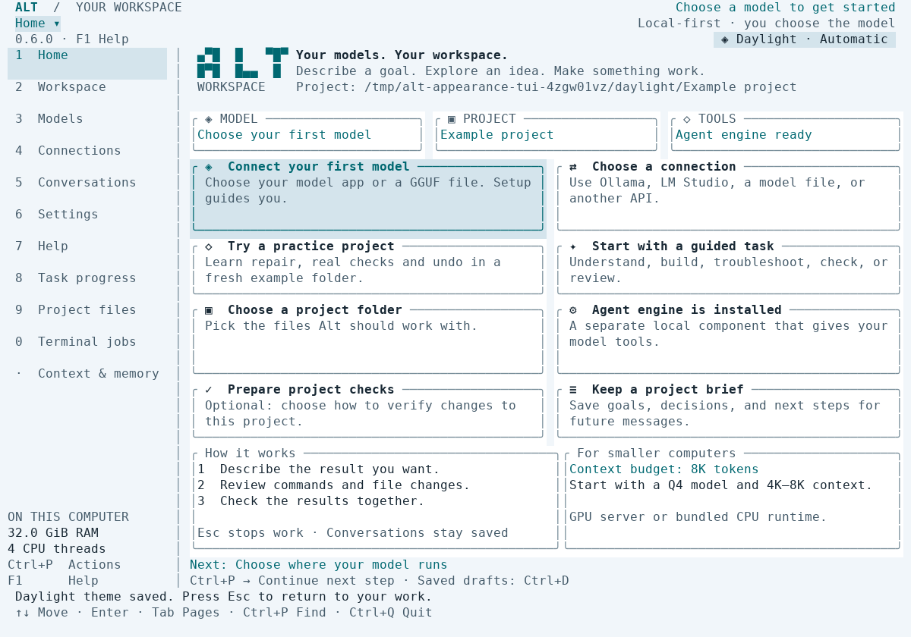
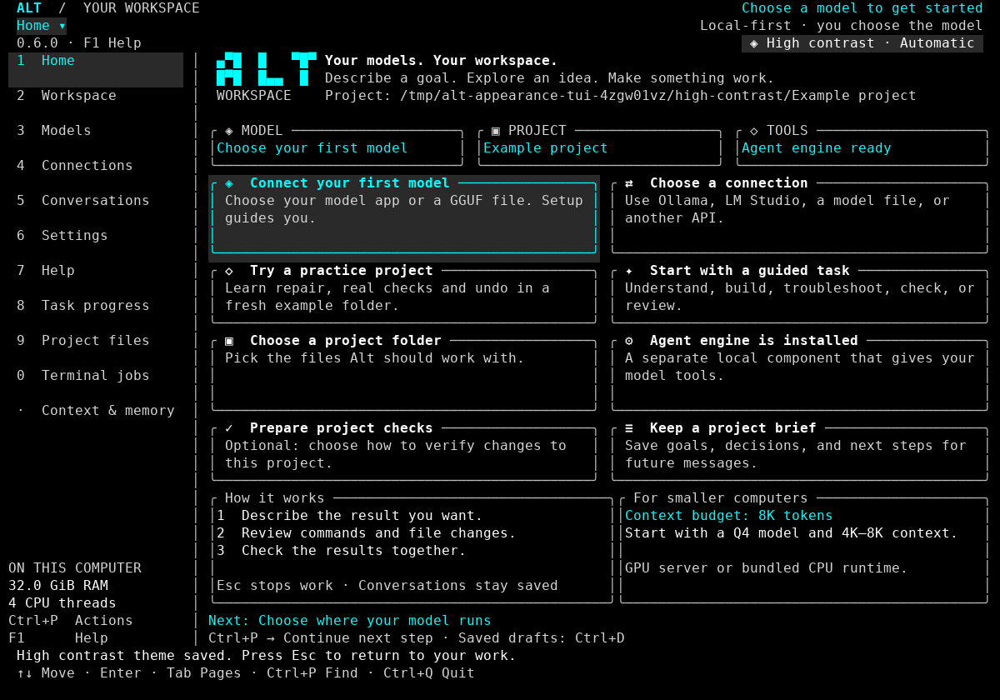
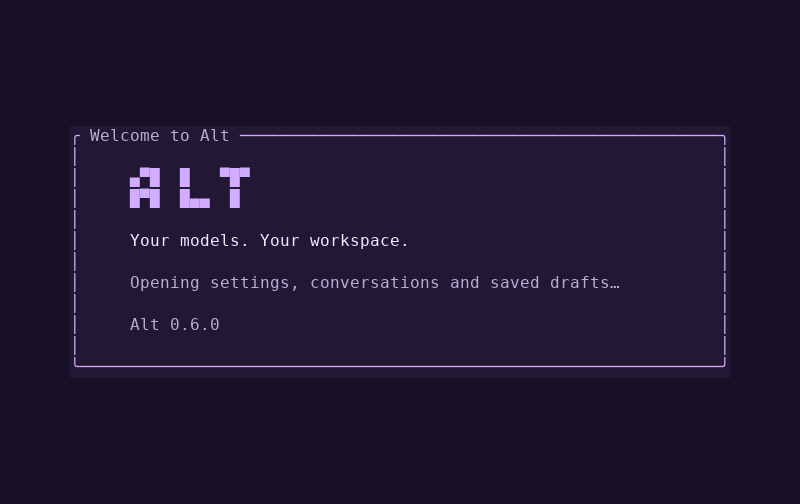
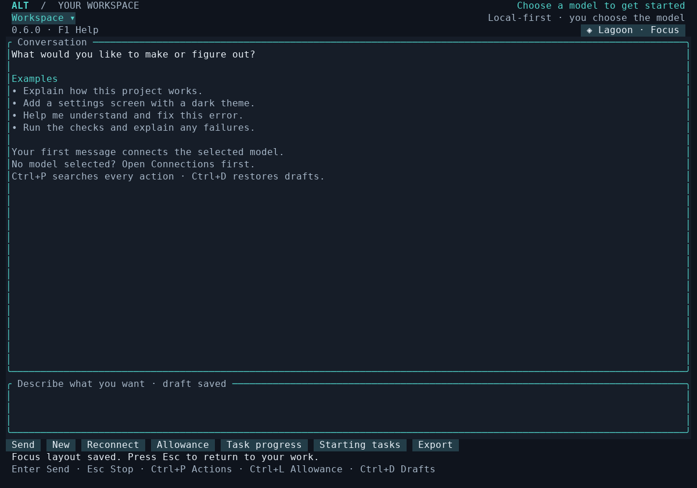
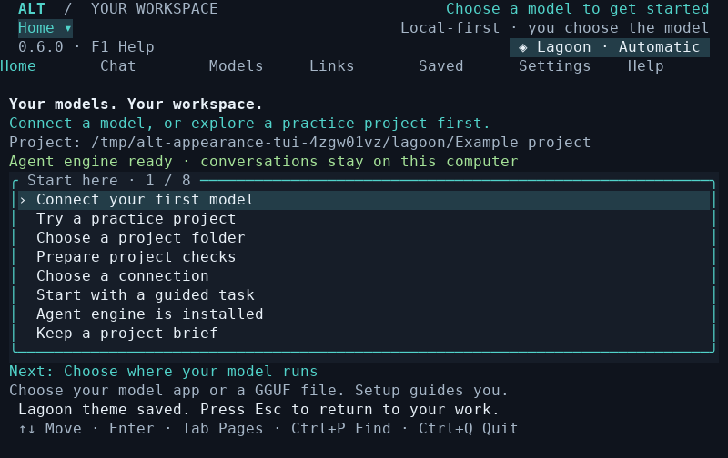

# Make Alt your own

Click the **theme name at the top right**, open **Settings → Appearance**, or
press **Ctrl+P** and search for **Appearance**. Choose a theme and press Enter.
It applies immediately and saves automatically; press Esc to return to your work.
The saved colors also apply to the next startup screen.

These controls are in the final-pass source branch. The published beta 3 predates
them; follow [Installation](INSTALLATION.md) to use this branch or its CI package.

## Six color presets

Each preset changes the whole interface: backgrounds, panels, selection, borders,
text, status colors and dialogs.

| Preset | Look |
|---|---|
| Lagoon | Deep blue surfaces and teal highlights; the default |
| Graphite | Neutral charcoal and cool silver |
| Aurora | Midnight violet and purple highlights |
| Ember | Warm dark surfaces and amber highlights |
| Daylight | Light surfaces, dark text and teal highlights |
| High contrast | Black surfaces, bright text and strong outlines |

### Lagoon

### Graphite

### Aurora

### Ember

### Daylight

### High contrast

These are actual 120×40 terminal buffers from the running application, rendered
to PNG with the repository's capture utility. They use a deterministic test
engine and no model weights. The hardware display describes the cloud computer.
Their text captures and binary identity are stored alongside the images.

## Your accent color

Choose **Accent color** and enter a six-digit hex color, such as `#7AA2F7`.
The leading `#` is optional. Leave the input blank or enter `default` to restore
the preset's accent. Invalid input stays available to correct.

Alt adjusts the displayed brightness when needed to keep text and selected
controls legible against your theme. Your entered color remains saved. Selecting
a different color preset restores that preset's accent.

## Four layouts

| Layout | Behavior |
|---|---|
| Automatic | Sidebar from 85 columns; tabs in narrower windows |
| Sidebar | Left navigation when the window is at least 80×22; tabs below that |
| Top tabs | Navigation above your work at every supported size |
| Focus | More room for the active page; press Tab to reveal navigation |

In every layout, **Ctrl+P** finds pages and actions. You can also click the
**page name at the top left** to open that search. Focus leaves this mouse control
visible. A narrow window temporarily adapts the layout without changing your
saved preference. The supported minimum remains **60×18**.

## Graphics and panels

With **Decorative graphics** on, Home shows the Alt mark, model/project/tool
status panels and a two-column action-card grid when space permits. Click a card
or use the arrow keys and Enter. Smaller windows use the compact action list.

Switch graphics off for simpler borders, a text heading and the compact Home
presentation. Colors and layout are separate choices. The graphics use terminal
characters; they do not load image assets, consume model context, or require GPU
inference. A terminal with true-color support and a Unicode monospace font best
matches the screenshots.

**Reset appearance** returns to Lagoon, Automatic layout and graphics on. It
leaves model connections, runtime settings, access choices and drafts intact.
Appearance is stored with Alt's preferences in your selected state directory.

## Validation

The appearance suite drives real keyboard, paste, mouse and resize events. It
checks all six presets across all 11 pages, saved themes after restart and tool
approval dialogs. It also visits every page in all four layouts at 120×40, 80×24
and 60×18, then tests graphics, invalid and valid accent input, reset, draft
preservation and terminal restoration.

Palette unit tests check at least 4.5:1 text contrast across the preset surfaces,
7:1 for the High contrast preset, and 750 custom-accent combinations. This checks
the RGB values Alt emits; terminal emulators and fonts can render them differently.

Run `python3 scripts/smoke_appearance_tui.py` after building Alt. Set
`ALT_TEST_BINARY` to test a particular build and `ALT_TUI_SCREENSHOTS` to retain
the observed screens and receipt. See the
[appearance evidence](evidence/appearance-2026-10-08/README.md) for the completed
run and regression checks. Model quality, physical GTX 1070 testing and uncoached
novice sessions remain separate from interface validation.
