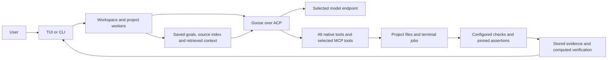

# Architecture

Alt is a Rust application with a Ratatui interface and a command-line interface.
Goose is a separately installed ACP agent engine. A model can run in an Alt-owned
llama.cpp process or in an independently managed compatible server. The native
tool boundary belongs to Alt; model prose is never the verification authority.

## Code map

| Module | Responsibility |
|---|---|
| `src/main.rs`, `src/tui/` | CLI dispatch, views, forms and keyboard interaction |
| `src/workspace.rs`, `src/project_worker.rs` | Background conversation/project work, cancellation and owned lifecycle |
| `src/engine.rs` | Goose-specific ACP integration, event handling and prompt context |
| `src/toolbox.rs`, `src/extensions.rs` | Native tools, access decisions and selected external MCP connections |
| `src/project.rs`, `src/project_services.rs` | Source snapshots, edit journals, requirements, current evidence and memory |
| `src/verification.rs` | Check contracts, bounded report parsers and independent assertion handling |
| `src/jobs.rs`, `src/sandbox.rs`, `src/process.rs` | PTY jobs, command execution, optional isolation and process identity |
| `src/models.rs`, `src/runtime.rs` | Model acquisition/library and owned inference processes/installers |
| `src/hardware.rs`, `src/benchmark.rs`, `src/qualification.rs`, `src/capability.rs` | Configuration identity, measured runtime behavior and explicitly scoped qualification |
| `src/config.rs`, `src/store.rs`, `src/schema.rs`, `src/storage.rs` | Preferences, conversation storage, migrations and recovery |
| `src/language.rs`, `src/syntax.rs`, `src/packs.rs` | Optional language services, syntax information and workflow adapters |
| `build.rs`, `scripts/package-linux.py`, `scripts/release_gate.py` | Embedded source provenance, packaging and exact-artifact validation |

## State and operations

Configuration and conversations live under the selected Alt data directory.
Project records use a separate SQLite database per project identity. Imported
model files remain at their original paths; managed models have verified library
records. Backups cover Alt state, not all external weights or project content.

Slow project and conversation operations run on workers. Results carry operation
identity and project generation so a result for an old project cannot overwrite
a new view. Read refreshes coalesce. Cooperative cancellation interrupts long
walks and lock waits; an atomic commit already underway finishes before its actual
result is reported. Terminal processes have PID, boot and start-time identity;
Alt must not signal an unrelated process that reused the same PID.

A model turn, a command result, required-check completion and independent behavioral
acceptance are separate outcomes. Verification retains the contract, structured
report, source/environment identity and assertion hash. Changes stale evidence.
Full access is normal host execution, not hostile-code isolation. Guided checks
use Bubblewrap and fail closed when unavailable. See [contracts](VERIFICATION_CONTRACTS.md).

## Model and context boundaries

The user selects the model/provider, tool focus and runtime settings. Adapters
must not silently substitute a different model or expand the tool inventory.
Persistent retrieval assembles a bounded working context from files and prior
decisions; it does not increase the model's native context or prove reliable recall.
External native context, memory and process lifecycle may be unobservable to Alt.
Missing observations stay unknown in qualification reports.

Goose-specific behavior stays in the engine adapter. The terminal UI should depend
on project services and typed outcomes rather than interpreting model prose.
Native tool, deterministic protocol, terminal, live-model and hardware tests each
establish different properties. Their boundaries are documented in
[implementation results](IMPLEMENTATION.md) and [contributor guidance](../CONTRIBUTING.md).
