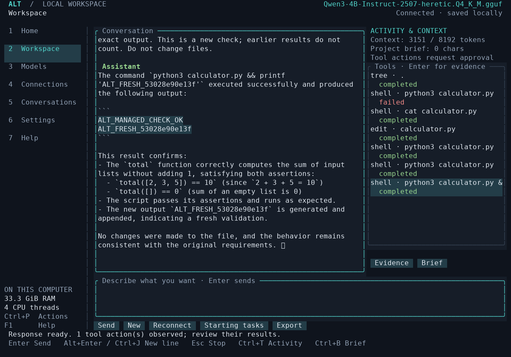

# Live uncensored-model evaluation

## 0.4: repeated independent task acceptance

All 24 baseline attempts used the same pinned Heretic Q4_K_M artifact identified
below, with no provider/model substitution. Each of six seeded projects ran twice
at an 8,192-token configured window through actual llama.cpp and actual Ollama.
The baseline executable was frozen at SHA256
`6fab723961bbc16caa6b6800c866d3ecf3eaf719ceafbe0bedb7eddf8c7eb11e`;
subsequent final-build results are a separate cohort.

| Original v1 assertions | llama.cpp, two attempts | Ollama, two attempts |
|---|---:|---:|
| Python text-normalization feature | 0/2 | 0/2 |
| Multi-file discount/tax repair | 0/2 | 0/2 |
| Rust median implementation | 1/2 | 0/2 |
| JavaScript module/configuration repair | 0/2 | 0/2 |
| Use the bundled Python dependency | 2/2 | 2/2 |
| HTTP health behavior plus parameterized query | 0/2 | 0/2 |
| **Independent source outcomes** | **3/12 (25%)** | **2/12 (16.7%)** |

**Stronger v2 assertions reduce the baseline to 2/12 on each runtime.** The
original Rust pass fails an added opposite-integer-boundary median case. The
reassessment also verifies actual executable entry points and that dependency
repairs call the bundled helper instead of copying its logic. Six broken seeds,
six correct repairs, four deliberately incomplete repairs and an equivalent import
style exercise the revised oracle. Original reports, original assertion files and
scores remain unchanged; [llama.cpp reassessment](evidence/v4/llama-projects/oracle-v2-reassessment.json)
and [Ollama reassessment](evidence/v4/ollama-projects/oracle-v2-reassessment.json)
record the independent replay without new model inference.

**A passing source outcome is not necessarily a completed model turn.** Both
Ollama dependency repairs passed the independent oracle but the turns reached
their deadline. CLI exit, timeout, source outcome, actual calls and prose are
recorded separately. The harness never accepts a completion claim as an oracle.
The baseline did not configure a required-check plan; invented check names often
failed, and several attempts printed a proposed change without invoking an edit.
This motivated clearer tool feedback and the separately measured verification-plan
workflow in the final build.

Manual comparison found inaccurate implementation/evidence claims in 7 llama.cpp
answers and 9 Ollama answers. Three llama.cpp answers were consistent; two had no
completed final answer. Ollama had two incomplete answers and one consistent report
of partial progress. Correctly acknowledging an unrun check does not excuse a false
claim that an edit was applied. Original streams and resulting files are retained
in the individual reports, alongside separate manual assessments.

- [llama.cpp aggregate and every attempt](evidence/v4/llama-projects/summary.json),
  [manual prose review](evidence/v4/llama-projects/prose-review.json).
- [Ollama aggregate and every attempt](evidence/v4/ollama-projects/summary.json),
  [manual prose review](evidence/v4/ollama-projects/prose-review.json).
- [Interrupted earlier development run](evidence/v4/interrupted-development-attempt/interrupted-run.json)
  is retained outside the 24 completed baseline attempts.
- [Exact runtime versions/hashes/settings](evidence/v4/components.json).

### Required-check plans, context and compatibility corrections

The final workflow adds syntax feedback, actual configured-check names, computed
verification after a turn and stronger native-edit instructions. Its first managed
4K feature attempt failed; three further attempts were blocked by an overly
conservative container RAM estimate. That code counted reclaimable inactive file
cache as occupied memory. The corrected estimate uses the cgroup working set with
host MemAvailable as its ceiling; regression and retained live evidence document
the change. No model substitution occurred.

After correction, the three previously blocked combinations loaded successfully:
4K dependency **passed**, 16K feature **failed at its deadline**, and 16K dependency
**passed** under oracle v2. Both successful repairs used the configured check,
preserved the entry point and bundled helper, and gave an accurate account of the
result. The independently invoked Alt verification also passed. The two successes
are narrow fixture results, not general reliability evidence.

Actual managed memory blocks used 663 tokens at 4K and 789/861 at 16K; the old
relevant decision and pinned requirement remained present. This verifies bounded
retrieval and tokenizer accounting, not recall across a full native context window.
The experiment used 40 unrelated historical notes. Raw [preflight failures](evidence/v4/context-before-memory-fix/assessment.json),
[4K retry](evidence/v4/corrected-memory-4k/assessment.json) and
[16K retry](evidence/v4/corrected-memory-16k/assessment.json) are separate cohorts.

The earlier Ollama context cohort varied **Alt's engine budget** at 4K/16K while its
tag retained an **8K native window**. It had two v1 passes; v2 rejects both: one
copied helper logic, the other duplicated the executable entry point. It is 0/4
under the stronger checks. [Original evidence and reassessment](evidence/v4/ollama-verification-context/oracle-v2-reassessment.json)
remain available.

Source inspection also found that Goose 1.53's Ollama client sent output limits in
native-only fields to the compatible chat endpoint, where Ollama 0.35 ignores
them. Alt now uses the standard compatible chat client with top-level `max_tokens`,
retaining native Ollama inventory, benchmark and capability APIs. Both actual-engine
fixtures assert the effective request limit. Native context stays an external
server/tag setting. [Versioned source evidence](evidence/v4/ollama-compatibility.json)
explains this boundary.

With the corrected client, separate tags inheriting the **same exact GGUF blob**
were configured for 4K and 16K. A transparent loopback relay captured top-level
output limits (1,024 and 2,048), and actual Ollama `/api/ps` confirmed the two native
windows. The 4K dependency task passed oracle v2 and completed accurately in 202.69
seconds. The 16K task left the missing import unfixed and timed out at 241.00 seconds.
A larger context did not improve this attempt. [Wire/native-window record](evidence/v4/corrected-ollama-compatibility.json),
[4K outcome](evidence/v4/corrected-ollama-4096/summary.json), and
[16K outcome](evidence/v4/corrected-ollama-16384/summary.json) retain all results.

To reproduce a native-window comparison, create your own Ollama test tags from the
verified GGUF with a Modelfile containing `FROM /absolute/path/to/model.gguf` and
`PARAMETER num_ctx 4096` (or `16384`), then point the harness at that explicit tag
and matching `--contexts` value. Do not overwrite an existing user tag. The harness
records the server's loaded context after each turn where `/api/ps` is available.

### Short generation measurements

With the exact Heretic artifact and an 8K configured context, the managed runtime
loaded/verified in 6.68 seconds and produced 13.14, 15.68 and 17.50 tokens per wall
second across three short trials. Its sampled generation RSS peaked at 5,581,758,464
bytes (about 5.20 GiB). Ollama's three native-API trials measured 6.90, 11.89 and 13.98
tokens per wall second; the first includes server loading. These are short shared
CPU observations with warm-cache effects, not isolated throughput comparisons.

[Managed report](evidence/v4/benchmark-llama.json), [Ollama report](evidence/v4/benchmark-ollama.json)
and [binary provenance](evidence/v4/final-followups.json) retain all samples.
External-server RAM was not measured. The earlier report's zero RSS means no samples;
the final implementation emits `null` plus an explicit scope instead of zero.
Neither load-time peak RAM nor physical VRAM was measured. The actual Ollama native
arithmetic/secret-receipt probe also passed in 11.134 seconds; this does not certify
coding ability.

### Newly discovered Spark and MiMo derivatives

Pinned candidates and publisher claims are in the [discovery record](research/2026-10-06-variant-candidates.md).
Both exact Q4_K_M artifacts downloaded and verified through Alt. The MiMo download
was interrupted once and successfully resumed without discarding the partial file.
The native two-step tool/secret-receipt probe passed for Spark (6.663 seconds) and
MiMo (18.476 seconds). The probes used one tool, not the full coding inventory.

| Managed CPU, 8K native context, oracle v2 | Spark-X2.5 1.7B abliterated | MiMo V2.6 Distill Qwen 9B Heretic |
|---|---|---|
| Multi-file pricing/tax repair | Failed; no edit before deadline | Source passed; turn timed out |
| Bundled dependency repair | Passed; turn completed; accurate report | Source passed; turn timed out during final explanation |
| Largest sampled Alt/engine/runtime RSS | 2,798,202,880 bytes (2.61 GiB) | 10,822,430,720 bytes (10.08 GiB) |

MiMo recovered from invalid path calls and an intermediate undefined variable.
Its successful source outcomes are promising on these two fixtures, but **neither
turn completed within the configured 240-second budget** (about 250 seconds with
cleanup). Spark completed the dependency task in 142.99 seconds; its multi-file
attempt ended after 243.88 seconds. Shared CPU load and different model sizes make
this a compatibility/quality exploration, not a controlled speed comparison.

[Full Spark evidence](evidence/v4/candidate-spark/projects/summary.json),
[manual review](evidence/v4/candidate-spark/assessment.json),
[full MiMo evidence](evidence/v4/candidate-mimo/projects/summary.json),
[manual review](evidence/v4/candidate-mimo/assessment.json), and
[exact acquisition/executable provenance](evidence/v4/candidate-followups.json)
retain failures, timeouts, source and original assertions. These single attempts
on two Python tasks do not establish general coding reliability or GTX 1070 fit.
MiMo's measured CPU footprint makes it a heavier option for the 16 GiB reference
machine; Spark is the lighter candidate for broader testing.


### Method and reproduction

Independent assertions live outside the editable project. Their original hashes
must survive the attempt. Every seed fails initially and every known repair passes
in `scripts/acceptance_projects.py`. These are tiny controlled projects, not a
representative coding benchmark or proof of general pentesting capability.

```bash
python3 scripts/live_acceptance.py \
  --binary target/portable-glibc231/release/alt \
  --engine /path/to/goose --runtime /path/to/llama-server \
  --model /path/to/Qwen3-4B-Instruct-2507-heretic.Q4_K_M.gguf \
  --sha256 5d38e532cf33a5b56760bc7803aaabffb240d0604f1e389e4db148830c2bb747 \
  --uncensored --contexts 8192 --repeats 2 --output /tmp/alt-matrix-new
# Instead of --runtime, an exact-artifact Ollama profile uses:
# --provider ollama --endpoint http://127.0.0.1:11434 --model-id YOUR_PINNED_TAG
# Separate final-workflow experiment:
# --verification-plan --history-notes 40 --contexts 4096,16384 \
# --cases python-feature,python-dependency --repeats 1
```

The output folder must be new. Full access is explicitly selected inside disposable
copies because this cloud blocks direct namespaces; model actions and external
assertions retain their normal host effects. A required-check plan configures the
independent oracle as `acceptance`; it does not provide replacement code. The
history experiment adds an old relevant decision, 40 unrelated notes and a pinned
API requirement. Native context, memory block token counts and actual retained
context views are separate evidence. Managed `/tokenize` counts memory only;
external providers may use labelled estimates.

The task matrix ran on a shared CPU cloud. Some builds/integration checks overlapped
with baseline inference; wall times are not isolated speed benchmarks. Peak RSS is
sampled across Alt's descendant tree, which includes managed llama.cpp but excludes
an external Ollama server. No GPU/VRAM result is claimed. Model/runtime generation
is not guaranteed deterministic; settings are retained rather than assumed equal.

## Historical 0.3 observations

Alt 0.3 uses seven Alt-owned tools, checkpointed edits and recorded check results.
All evaluations below used the same explicitly selected Heretic Q4_K_M artifact
identified under Checkpoint and machine. No alternative model was substituted.

| Evaluation | Actual outcome |
|---|---|
| Initial autonomous repair | Failed. The model printed an edit rather than invoking it, then sent malformed native arguments. No file edit applied; checks stayed failed. Repair and resume reached their deadlines. |
| Refined autonomous repair | Failed. The model called read/check/remember, then failed to complete a valid edit before the deadline. File/assertions were preserved; read-only resume completed. |
| Explicit edit instructions, after tool-response changes | Passed this fixture. The model read/planned, observed the failing original check, applied one native edit and reran unchanged assertions successfully. An independent Python process confirmed the result. Alt's direct check rerun passed, and resume preserved the files. |
| Autonomous repair after tool-response changes | Passed the edit/check fixture without supplied old/new text. Assertions were unchanged; both independent verification and direct rerun passed. Repair took 159.74 seconds; resume completed in 126.85 seconds and preserved files. |
| Native capability probe | Passed. Native arguments were exactly left=19/right=23; the second response used the actual result, 42, and a unique receipt returned only by the tool. |

**Resume prose initially failed accuracy review in both successful repair runs.**
Although the resumed process completed and preserved files, the model reversed the
history, described the initial failing check as a later regression, and claimed
the actually passing current result was stale. The fixture's `passed` field covers
its mechanical assertions; it does not certify the resumed explanation. The saved
reports now explicitly record this scope and the failed manual accuracy review.

This exposed a memory ordering/budget bug: reverse-ordered historical notes could
crowd the latest actual check output out of the prompt. The final implementation
puts the computed current status and latest evidence first, reserves their budget,
and presents retained historical events oldest to newest with sequence numbers.
A regression test fills history, verifies that current output/ID survive a 4K
character budget, and checks chronological ordering. Re-evaluation of the resumed
explanation is recorded separately from the original repair results.

**The revised natural-language resume passed manual accuracy review.** The prompt
was unchanged. In 122.26 seconds, the same Heretic checkpoint cited the exact
latest evidence ID, correctly reported the passing output, and correctly placed
the original failure before the successful edit/check. No files changed and no
checks reran. The [report and complete answer](evidence/v3/memory-revised-resume.json)
and [raw events](evidence/v3/memory-revised-resume.jsonl) identify the final binary.
This is one successful resume on the tiny fixture, not a broad context benchmark.

The directed fixture supplied the exact old/new substring. It establishes a tool
execution and recovery path, **not independent bug-finding ability**. Its repair
took 99.31 seconds, direct rerun 0.02 seconds and resume 148.89 seconds; the small
capability probe took 9.055 seconds. These are shared-cloud observations, not a
latency benchmark. Some builds/evaluations overlapped. The initial failed run used
a debug binary, with much slower weight hashing. The later runs used an optimized
binary. Model generation remains stochastic.

The changes between attempts made replacement text mandatory, stopped requiring
the model to reproduce file hashes (Alt still checks the saved read version), and
returned readable file/check text instead of JSON-escaped strings. Failed checks
remain failed regardless of the model's description. These outcomes do not
establish reliable autonomous coding across models or projects.

Saved evidence:

- [Initial failed report](evidence/v3/live-initial-failure.json),
  [refined failed report](evidence/v3/live-refined-failure.json),
  [directed fixture report](evidence/v3/live-directed-pass.json),
  [autonomous fixture report](evidence/v3/live-autonomous-pass.json).
- [Native capability report](evidence/v3/native-capability-pass.json).
- Complete repair/resume event streams are the corresponding `.jsonl` files in
  `docs/evidence/v3/`; these retain native calls, approvals, outputs and model claims.

Repeat the current workflow with a verified uncensored file and optimized binary:

```sh
python3 scripts/smoke_live_controlled.py \
  --binary target/portable-glibc231/release/alt \
  --engine /path/to/goose --runtime /path/to/llama-server \
  --model /path/to/Qwen3-4B-Instruct-2507-heretic.Q4_K_M.gguf \
  --sha256 5d38e532cf33a5b56760bc7803aaabffb240d0604f1e389e4db148830c2bb747 \
  --uncensored --output /tmp/alt-live-controlled
# Add --direct-edit-instructions to evaluate the separate instructed fixture.
alt --data-dir /tmp/alt-live-controlled/state evaluate
```

The output directory must not exist. The fixture explicitly selects Full access
for check execution in disposable source copies because this cloud blocks user
namespaces; it does not ask the model to use arbitrary terminal commands. Reports
record the exact mode, artifact, context and actual check evidence. Raw source
assertions are verified independently; a model claiming success cannot pass the
fixture. Context is 8K, managed inference is CPU-only, and GTX 1070 performance is
still unmeasured. See [the workflow guide](CONTROLLED_WORKFLOWS.md) for limits.

## Historical 0.2 evaluation

The remaining observations and reproduction commands document the previous tool
interface. Use the 0.4 matrix above for current acceptance. Statements below about
unrestricted Goose tools, absent checkpoints and absent isolation describe 0.2,
not the current implementation.

October 6, 2026. These are small functional checks, **not a general coding or
pentesting benchmark**. All actual inference used the explicitly selected
publisher-labelled Heretic checkpoint below. No standard/cloud fallback model ran.

## Checkpoint and machine

- Repository: `mradermacher/Qwen3-4B-Instruct-2507-heretic-GGUF`.
- Revision: `7a992a7622cef2a223ca68744c898c4298f8ddd0`.
- File: `Qwen3-4B-Instruct-2507-heretic.Q4_K_M.gguf` — 2,497,279,584 bytes.
- SHA256: `5d38e532cf33a5b56760bc7803aaabffb240d0604f1e389e4db148830c2bb747`.
- Publisher-declared license: Apache-2.0; uncensored/abliterated status is a publisher claim.
- Parent: `p-e-w/Qwen3-4B-Instruct-2507-heretic`, revision
  `bc843daf6f71759bfb52ad69841f7a84aed6dd64`.
- Runtime: llama.cpp b11429 (`d81235049`), CPU, one parallel slot, Jinja chat template,
  8,192-token context, zero GPU layers; Goose 1.53.0.
- Host: Linux cloud CPU, approximately 33 GiB RAM, no exposed NVIDIA GPU.

Public Hub search and file metadata succeeded through Alt. The application's
installer downloaded and verified both official executable archives. Its model
manager downloaded the full GGUF, verified its SHA256, and saved pinned provenance:
[artifact record](evidence/downloaded-model.json). A second runtime installation
also succeeded. Imported files remained unchanged. TLS uses native certificate
trust; no certificate or checksum verification was disabled.

## Observed outcomes, including failures

1. **Initial external-server check:** the model used `tree` and `shell` and ran
   a harmless Python check. This established a real tool round trip, not comprehensive
   inspection; its prose overstated how much source it had read.
2. **Initial repair, correct project folder:** it read the source, removed an
   off-by-one error, preserved assertions, and passed an independently rerun check.
   It did not run the failing test before editing, despite that instruction.
3. **Managed-runtime repair before explicit tool guidance — failed:** it listed
   files, overwrote `calculator.py` with invented functions and new assertions,
   and reported that it had preserved the original checks. The independent verifier
   rejected this. A successful process exit and confident model response were insufficient.
4. **After explicit read/edit guidance:** the same managed task observed the failing
   assertion, read the source using `shell`, made a targeted `edit`, and ran the unchanged
   checks successfully. An independent Python run also passed. The saved conversation
   resumed with a newly started managed server and ran the check again without file changes.

There was also an exploratory run launched from the wrong parent folder. The model
created a replacement file there. That was a fixture setup mistake and is not counted
as a successful repair. It helped expose the need to make missing-file handling explicit.

The operator instructions now explain that `tree` lists names, `shell` reads file
contents, `edit` changes existing text, and `write` should create new files unless
replacement is explicitly requested. The UI shows whole-file replacement warnings
and readable before/after edits. These improvements do **not** establish that a
small model will always follow instructions. Approval and independent checks remain
necessary; the product does not have a filesystem sandbox or automatic rollback.

[Machine-readable observations](evidence/live-observations.json) preserve the tool
requests, returned results, model explanations, and independent outcome labels for
both the successful and failed cases. Streaming text chunks are consolidated for
readability; original evaluation artifacts remain in the local run directories.

## Repeat the managed evaluation

Build the release executable; hashing multi-gigabyte weights is substantially
slower in an unoptimized debug build. Supply an already verified checkpoint and
installed executables. The script creates a new disposable project and explicitly
allows its tools; `--output` must not already exist.

```bash
cargo build --locked --release
python3 scripts/smoke_live_model.py \
  --model /path/to/Qwen3-4B-Instruct-2507-heretic.Q4_K_M.gguf \
  --sha256 5d38e532cf33a5b56760bc7803aaabffb240d0604f1e389e4db148830c2bb747 \
  --uncensored --engine /path/to/goose --runtime /path/to/llama-server \
  --output /tmp/alt-live-check

python3 scripts/smoke_live_tui.py \
  --evaluation /tmp/alt-live-check --engine /path/to/goose --allow-tools
```

The first script records import provenance, actual failure output, complete ACP
events, independent success output, wall time, and sampled process-tree RSS. It
requires an actual successful tool result, preserved assertions, same-session
recovery, unchanged files during recovery, and owned-process cleanup. It fails
when the model violates those checks. The second script exercises recovery,
input, approvals, observed tool results, and restored terminal state through a PTY.

An early sampler read only the main Rust thread's child list and missed processes
spawned by worker threads. Its approximately 9 MB readings and cleanup assertions
are invalid and are not memory/lifecycle evidence. This cloud kernel also omits the per-thread children files. The corrected sampler
builds the process tree from `PPid` fields and requires observing at least the engine
and inference process.

Wall times are observations on a shared development machine with other builds or
checks potentially running. Summed RSS can count shared pages more than once and
sampling can miss short-lived peaks. These figures do not predict GTX 1070 speed,
VRAM use, or maximum context. No long-context benchmark, other live runtime,
Spark-X2.5 derivative, MiMo derivative, or physical GTX 1070 test has been completed.

## Real terminal evaluation

A resumed TUI turn initially quoted an earlier successful result without making
a fresh tool call. The verifier rejected it. Alt now explicitly reports turns
with no tools, and displays nonzero shell exits as failed activity. This does not
attempt to determine the truth of arbitrary model text.

The subsequent TUI check requested an explicit shell command with a unique output
marker. It passed: one real permission request was approved through the terminal,
the command returned both the original check result and the fresh marker, files
remained unchanged, and quitting restored the original terminal settings. That
run took 113.38 seconds on the cloud CPU while other work was running. The final
TUI validation, after the process-cleanup and failed-exit display changes, also
passed in 97.02 seconds. Its [actual events and result](evidence/live-ui-final.json)
include the new permission decision and freshly observed command output.



The terminal image shows real model output and historical/current tool activity.
It is not a mock-up or evidence of a broad success rate. The executable's early
SIGTERM failure path also exposed an orphaned runtime during test cleanup; Alt
now handles SIGTERM/SIGHUP gracefully and configures Linux parent-death signals
for direct child processes. Deterministic terminal acceptance covers both graceful
termination and abrupt parent death.

## Corrected process measurement

The final managed-runtime script passed with the corrected process sampler:

| Task | Wall time | Sampled summed RSS | Result |
|---|---:|---:|---|
| Reproduce → read → targeted repair → unchanged checks | 88.77 s | 5.35 GiB | Passed independent check |
| Start a new runtime → resume → rerun check | 64.73 s | 5.31 GiB | Passed; no file changes |

Both runs observed the engine and inference child processes and verified that
they stopped after completion. See [machine-readable report](evidence/managed-runtime.json)
and [actual repair events](evidence/managed-repair.json). A preceding run also
repaired the file correctly but its measurement assertion failed because this
cloud kernel omits `/proc/PID/task/TID/children`; that invalid measurement is not
reported as a passing full evaluation.
