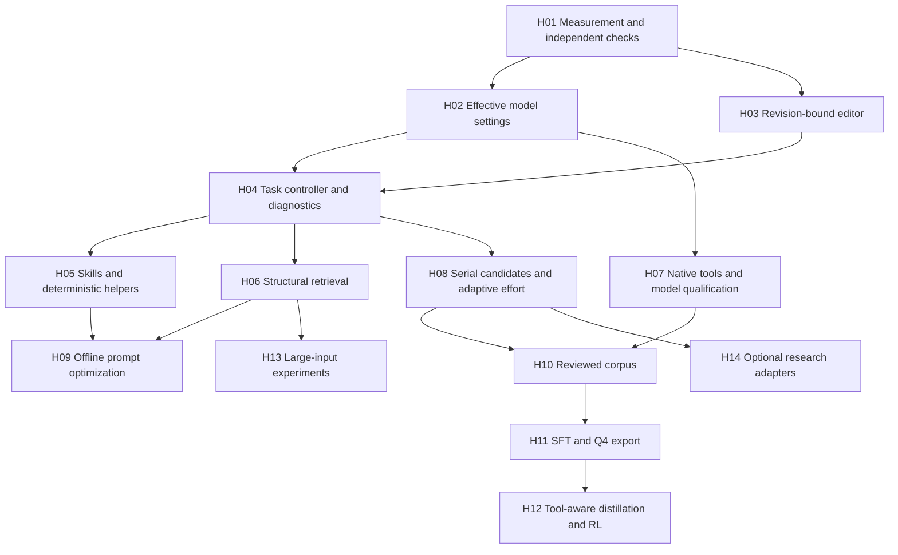

# Small-model implementation and training plan

October 7, 2026. This combines both completed research passes into one delivery
plan. **The runtime work below is planned, not implemented.** The accompanying
[training handoff](../training/README.md) implements preparation/validation tools
and an optional SFT starter; no weights have been trained or promoted.

Inputs: [harness research](research/2026-10-07-small-model-harness.md),
[SM-01–12](research/2026-10-07-small-model-experiments.md),
[reasoning research](research/2026-10-07-small-model-reasoning.md) and
[RE-01–08](research/2026-10-07-reasoning-experiments.md). Their pinned source ledgers
remain the evidence for external claims. Published benchmark gains are hypotheses
for Alt, not measured improvements in Alt.

## Delivery target

Keep the Rust application and replaceable Goose engine. Make a small local model
effective through dependable tools, relevant evidence, explicit effort allocation
and independent checks. Improve the weights through reviewed training after those
interfaces stabilize. Do not rewrite the application around a research framework.

The deployment matrix includes **1–4B, 7B Q4 and 9B Q4**. The owner's current
machine is Linux, GTX 1070, 8 GB VRAM and 16 GB RAM. A 7B/9B model is a normal
user-selected deployment target; it does not have to be replaced with a smaller
model. CPU and partial GPU offload remain available when a fully resident profile
does not fit. Larger/newer GPUs and external compatible endpoints use the same
harness with separately measured limits. ORA remains a generic endpoint.

Full access retains arbitrary shell commands, networking and user-selected tools.
Tool focus, effort and execution access are separate settings. No feature silently
changes the model, sends work to a cloud teacher or adds another inference model.
All live evaluation roles use explicitly selected uncensored/abliterated weights.
The product continues to accept other compatible models at the user's choice.

## Order and dependencies

H01–03 are the first implementation tranche. Land independently reviewable changes
and screen each factor before combining them. H04–07 form the dependable workflow
tranche; H08–09 add measured inference improvements. H10–12 are the weight-training
track. H13–14 have explicit experiment gates; they remain optional capabilities
until simpler approaches leave a demonstrated gap.

## Work orders

| Order | Research covered | Deliverable and main code boundary | Acceptance evidence |
|---|---|---|---|
| **H01** | Measurement sections of both passes | New versioned development fixtures and new unseen held-out families in `scripts/acceptance_projects.py`, `acceptance_extra.py`, `live_acceptance.py`; immutable campaign manifests and task-group metrics | Broken seeds fail; reference repairs pass; counterexamples, early exit, altered tests and stale results are detected; all attempts/timeouts retained |
| **H02** | SM-01, RE-01 | Versioned effective profile in `src/config.rs`, `runtime.rs`, `engine.rs`, `benchmark.rs`; provider request inspection and truthful TUI settings | Actual requests show total output, supported thinking controls, template/parser, sampling and context; unsupported fields are visible; tools still complete within allocation |
| **H03** | SM-02 | Hash-bound range/symbol handles in `project.rs` and `toolbox.rs`, with existing checkpoint/diff/undo | Stale or ambiguous handles never write; CRLF, Unicode, duplicate symbols, concurrent edits, failed multi-file operations and undo are exercised; edit errors and independent success improve together |
| **H04** | SM-04–05, RE-02 | Host-owned inspect/patch/check/recover state and compact diagnostic packets in `project.rs`, `project_worker.rs`, `workspace.rs`, `engine.rs`, `toolbox.rs` | Restart preserves facts, hypotheses and raw references separately; configured checks are real subprocesses; no stale verification; fewer unchanged tasks and unsupported completion claims |
| **H05** | SM-03, SM-08 | Versioned `SKILL.md` packs plus executable recipes, integrated with existing check/tool packs | Four initial packs pass independent fixtures; no-skill/short-skill/helper comparisons; metadata selection and active prompt costs bounded; explicit prerequisite and failure recovery |
| **H06** | SM-06, RE-02 | Symbol/dependency outlines and lexical retrieval in `project.rs`, with revision-aware evidence handles | Better localization and restart recall at equal prompt budget; edited/deleted source invalidates excerpts; indexing, RAM and latency measured |
| **H07** | SM-07, RE-05 | Capability probes and exact model qualification in `models.rs`, `runtime.rs`, `benchmark.rs` and provider fixtures | Native tool arguments, stream behavior, supported grammar, malformed calls and cancellation checked; 7B/9B Q4 profiles have their own results; no template-only claim of reasoning ability |
| **H08** | SM-09, RE-03–04 | Isolated serial candidate checkpoints and evidence-driven effort controller | One versus two/three candidates under equal total allowance; checkpoints do not mix evidence; cancellation/resume preserve user edits; independent selection beats fluent self-scoring |
| **H09** | SM-10 | Offline prompt/skill optimization adapter and versioned candidate registry | Explicit permitted optimizer model; development-only feedback; separate validation; full optimization cost; human-readable diff and rollback for promoted instructions |
| **H10** | SM-11, RE-06 | Reviewed trajectory capture, task-family split registry and preparation pipeline | Native tools/results, hashes, rights, privacy and source correctness reviewed; no sealed-task leakage or automatic promotion of historical “passes”; training artifacts contain only accepted splits |
| **H11** | SM-11, RE-06 | Concise/mixed SFT pilot; adapter manifest; native-template qualification; merged high-precision and Q4 export | Same student before/after; masked observation tokens; no silent truncation; fresh held-out behavior and tool reliability evaluated before/after quantization |
| **H12** | SM-11, RE-07 | SOD/on-policy distillation and optional verified-reward RL as offline jobs | Working SFT baseline first; permitted teacher and licensed data; invalid rewards excluded; altered tests/no-op/timeout/wrong answer cannot win on formatting or length |
| **H13** | SM-12 | Bounded recursive document/code analysis experiment using serial inference | Retrieval has demonstrated an unmet task; depth/call/time caps and evidence provenance tested; compare against retrieval at equal effort; no “infinite context” claim |
| **H14** | RE-08, relevant SM-07–12 | Individually qualified OptiLLM/ThinkBooster/search/PRM or specialized-solver adapters | Actual source-state execution and external checks; every extra model/call/resource disclosed; keep only measured useful approaches |

### H01: establish the measurement boundary

Keep the 0.6 evidence and oracle unchanged. Its 7/120 Spark and 16/120 Qwen passes
have known limitations; those runs used different settings and are not a matched
comparison. Some passes fail broader checks, so the 23 passing attempts must not
become a training dataset automatically.

Add known hash-collision/`None` deduplication, date-boundary and isolated-node
counterexamples to a new development version. Clarify configuration/output
contracts. Keep genuinely new task families sealed for final evaluation. Training,
prompt optimization and skill selection may see development data, never that sealed
set. Hold validation out of gradient updates and final test out of model selection.

Record artifact, executable, oracle, source and request identities. Preserve
failed/cancelled attempts and source diffs. An external behavioral check is separate
from a model's success text, compilation, parser validity or answer agreement.

### H02–04: fewer wasted turns and truthful controls

Replace the hidden `(context_tokens / 4).min(2048)` output limit with explicit,
migrated settings. Allocate input, total generated output, reasoning and action
headroom separately; use runtime token counts where available and mark unknown
accounting otherwise. Candidate Spark thinking allocations are 0/256/512/1024,
screened under a common total allowance. A non-thinking checkpoint such as Qwen
Instruct-2507 gets no fictional thinking switch.

Handles identify the exact source revision and span, so the model need not repeat
large exact strings. Supported symbol replacement can use reviewed tree-sitter or
ast-grep components; retain a clear range fallback. Do not transplant a complex
editor language wholesale. Unsupported syntax and concurrent edits must produce a
recoverable observation, never fuzzy writes into a different location.

Persist the user's goal, next decision, source revision, latest observation,
hypothesis, unresolved question and remaining budget. Return actual failure codes,
locations and expected/actual values only when the check supplies them. Keep full
logs accessible through evidence handles. A host-created workflow is distinct
from a model-created plan; changing the required-plan profile is an explicit
configuration/experiment change.

### H05–07: tools and context that fit small machines

Initial skills: Python test repair, Rust diagnostics, JavaScript setup and local
browser checks. Add dependency/security review and configuration/data workflows
after their helpers and independent checks work. Use existing Alt packs. Skill
metadata search happens in the host; load a small relevant shortlist and one active
procedure, then references as needed. Screen 300–700 active procedure tokens as
an experiment, not a universal rule. Measure executable recipes before generated
CodeAct-style programs. A pack declares prerequisites, supported versions,
provenance, expected outputs and recovery; it does not grant permissions.

Start retrieval with exact/lexical search plus bounded symbol/dependency maps.
Optional embeddings, LSPs, browser processes and rerankers need measured benefits
and separate memory accounting. Use runtime grammar enforcement only when the
actual server and tool schema support it. Valid JSON does not establish valid
arguments or correct behavior. Treat documentation lookup as version-specific;
online Context7 is not an offline documentation store.

Candidate cohorts begin with the exact existing Spark derivative, then explicitly
selected SmolLM3/DeepScaleR/VibeThinker derivatives as justified. VibeThinker's
coding benchmarks do not establish native-agent capability; the `-fc` derivative
needs real round trips. MiMo stays in discovery: distinguish local 7B artifacts
from large MoE or hosted variants. Never infer a 7B or 9B architecture from size
alone. Model-card benchmark numbers do not transfer to an abliterated Q4 artifact.

Review code and model terms before importing components. In particular, current
Serena application GPL terms differ from SolidLSP; LFM/Nemotron model terms and
Heretic's AGPL code need separate handling. Dataset reuse rights are independent
of a training framework's Apache/MIT license. Use both research ledgers for the
component-specific findings.

### H08–09: stronger inference without hidden dependencies

Quick/Careful/Thorough are proposed novice choices for one/two/three serial
candidates, with a displayed shared time/token allowance. They describe effort,
not guaranteed quality. Native context, effort, tool focus and Full/Guided access
remain separately visible. Defaults come from measured profiles; switching effort
does not change the selected model or external endpoint.

Each candidate gets an isolated source snapshot, ancestry, diff and real check
results. Extra hypotheses should address a concrete unresolved failure. New
discriminating tests require trusted contracts, reviewed properties or a reference;
the student cannot invent its own correctness oracle. Equal wrong answers are not
verified success. Charge all drafts, reasoning, retrieval, tools and selection to
the shared budget. Cancel must stop owned work promptly and preserve drafts.

Begin adaptive effort with a simple host policy using actual progress/failures.
DART-style agreement is an optional routing experiment after its empty-answer and
equivalence defects are addressed. DSPy/GEPA runs offline with an explicit allowed
reflector; preserve instructions/version history and all costs. Neither introduces
a mandatory cloud model to ordinary local operation.

### H10–12: training changes the weights

Collect authorized, correctness-reviewed trajectories from varied repositories,
including successful recovery from real failures. Split by task family/repository
lineage before generation, not by random turns or repeated attempts. Begin with
easy/medium examples and concise evidence-grounded decisions, then compare mixed
lengths at matched training updates. Do not manufacture private chain-of-thought
or train on fabricated tool observations. Train actual assistant decisions and
native tool actions; user/tool evidence is context, masked from the loss.

The handoff contains family-neutral 7B/9B QLoRA templates. They require an exact
uncensored Hugging Face training checkpoint and tokenizer/chat template. A Q4 GGUF
is an inference artifact; standard PEFT training uses the HF checkpoint with
on-load NF4 quantization. LoRA adapters must match the exact derivative, not merely
its upstream model family. Qualify template serialization before loading weights.

After SFT, compare unchanged weights versus adapter on the same native-tool
workflow, then merge/export and repeat with Q4. Promote only after held-out task
success, supported claims and ordinary tool/recovery behavior meet the frozen
criteria. Validation loss alone is not a deployment gate. Preserve the original
uncensored workflow preferences through the data and measure resulting behavior;
no fine-tune guarantees perpetual non-refusal or stronger reasoning.

SOD/OPD or RL follows a useful SFT baseline and qualified GPU resources. The
published SOD/DeepScaleR/long-reasoning recipes use much larger training resources
than a GTX 1070. First test rewards against invalid gold, altered tests, partial
repairs, timeouts and false success; correctness gates efficiency rewards. Keep
teacher inference offline and explicit. The inspected Open-AgentRL cards do not
establish dataset reuse/redistribution rights, so no automatic import is planned.

### H13–14: research gates

Recursive analysis needs a real retrieval failure before adding nested calls.
OptiLLM MCTS conversational scores and learned PRM scores cannot replace actual
repository checks. Preserve native tools when evaluating proxies. Count all
branches and any teacher/router/reranker in total cost. Coconut needs a different
training/inference path; HRM/TRM puzzle solvers are not drop-in general LLM skills.
Keep these as measured research adapters or specialized tools, without making
latent-model rewrites a dependency of the CLI release.

## 7B/9B Q4 and GTX 1070 qualification

| Target | Initial screen | Escalation after a passing screen |
|---|---|---|
| 1–4B quantized | One loaded model, 4K/8K; baseline CPU and compatible GPU runtime | 16K then larger windows if memory, latency and tool behavior pass |
| **7B Q4** | Exact artifact, 4K then 8K, measured GPU layers; CPU/partial offload available | Increase offload/context independently; compare Q5/Q6 as a separate experiment |
| **9B Q4** | Same 4K/8K method with architecture-specific cache/buffer accounting | Full residency only if measured headroom permits; otherwise retain user-selected model with partial offload |
| Newer/larger hardware | Same exact profile/fixtures, supported kernels and greater capacity | Publish separate results; do not transfer them to Pascal |

Illustrative packed four-bit payload is about 3.26 GiB for 7 billion parameters or
4.19 GiB for 9 billion. Actual mixed-Q4 artifacts have scales, higher-precision
tensors and metadata. Use their measured bytes, never these payload figures as a
fit promise. For ordinary full-attention layers, a rough KV estimate is
`2 × layers × KV heads × head dimension × context × bytes per cache element`.
Sliding-window/hybrid layers, cache layout and implementations need their actual
accounting. Add compute buffers, prefill peaks and desktop/driver headroom.

Measure Alt, inference server and tools separately: free/peak RAM and VRAM,
model load, prompt processing, time to first useful action, generation speed,
check latency and cancellation. Partial offload can increase system RAM pressure;
16 GB RAM is not an additional 16 GB VRAM. Use a tested Pascal/sm_61 CUDA 12 build
or qualified CPU/Vulkan path; do not assume BF16/FlashAttention or CUDA-13 support.
Training resources are separately qualified; Q4 inference fit is no QLoRA fit test.

For exact user models, record repository/revision, GGUF hash, quantization,
architecture, template/parser, runtime build, context, cache type and offload.
Until those identities and the physical PC measurements exist, compatibility and
performance remain unqualified. No 7B/9B preset is promoted by this planning work.

## Evaluation and release gates

1. Run deterministic correctness/recovery tests for each interface before model
   trials. Rust changes require tests, formatting and strict Clippy; TUI changes
   require real PTY journeys, including small terminals, missing prerequisites,
   cancellation and restart. Engine changes cover OpenAI and Ollama fixtures.
2. Freeze a new suite and screen one factor: eight development tasks × three
   repeats × two arms × two explicitly selected models = 96 attempts. Choose a
   qualified 7B or 9B cohort when hardware is available; a small-model cohort is
   useful too. More budget or a different checkpoint is a separately labelled
   comparison. Do not confound harness, quantization and reasoning changes.
3. Confirm the chosen design: 20 development tasks × five repeats plus four new
   held-out families × five repeats = 120 per arm/model, 480 for two arms/two
   models. More varied real repositories remain necessary for broad claims.
4. Match weights, template/parser, context, sampling, feedback, access and total
   effort except the tested factor. Randomize/block run order. Report uncertainty
   grouped by task, all failures, source unchanged, unsupported claims, edit/call
   errors, latency, tokens and resource peaks. Report single-candidate success,
   selected-best-of-k and offline oracle coverage separately.
5. Pre-register each experiment's keep/reject criteria: primary independent
   success, acceptable latency/memory for its hardware profile, no broken
   cancellation/undo or hidden model substitution. Small screens nominate a
   candidate; they cannot prove universal reliability. Preserve negative results.
6. Package the exact tested executable; verify install/update/rollback and the
   PC recorder. Physical GTX 1070 and novice human journeys remain external
   gates. Explain “checks passed for these behaviors” rather than “everything is
   correct.” Drafts, failed attempts and remaining work stay accessible.

## Immediate implementation sequence

First PR: H01 oracle/campaign boundary. Second: H02 profile migration, request
accounting and token reservations. Third: H03 editor handles. Next: H04 controller
and diagnostics, then individually measured H05/H06/H07. Capture reviewed traces
with H10 while evaluating those stable interfaces. H08/H09 can follow independently;
H11 requires that corpus and qualified training hardware. H12–14 require their
explicit evidence/resource gates. Each PR includes behavior, relevant regression
evidence, migration/rollback and an implementation-status entry.

The training handoff can be used now to collect/review data and qualify the exact
7B/9B checkpoint. This cloud checked 32 GiB cgroup RAM and four CPU cores of quota,
with no CUDA device or training libraries. No meaningful model-training run was
performed; the [training status](../training/status/cloud-capability.json) and
handoff state exactly what was checked and what remains to run.
