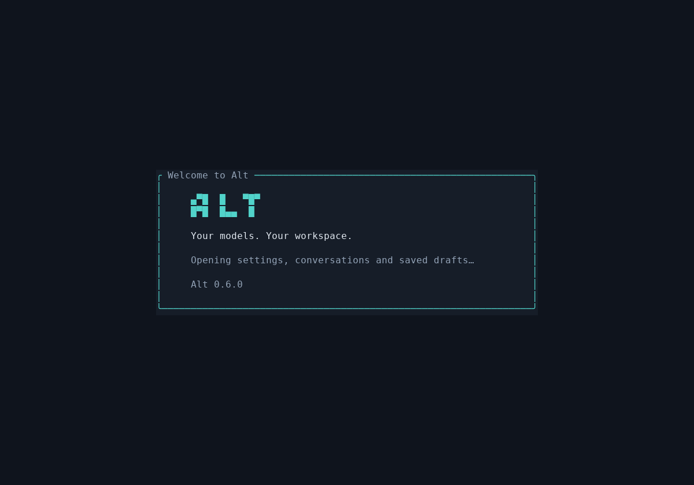
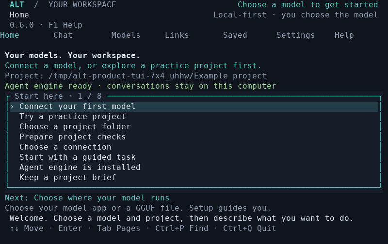
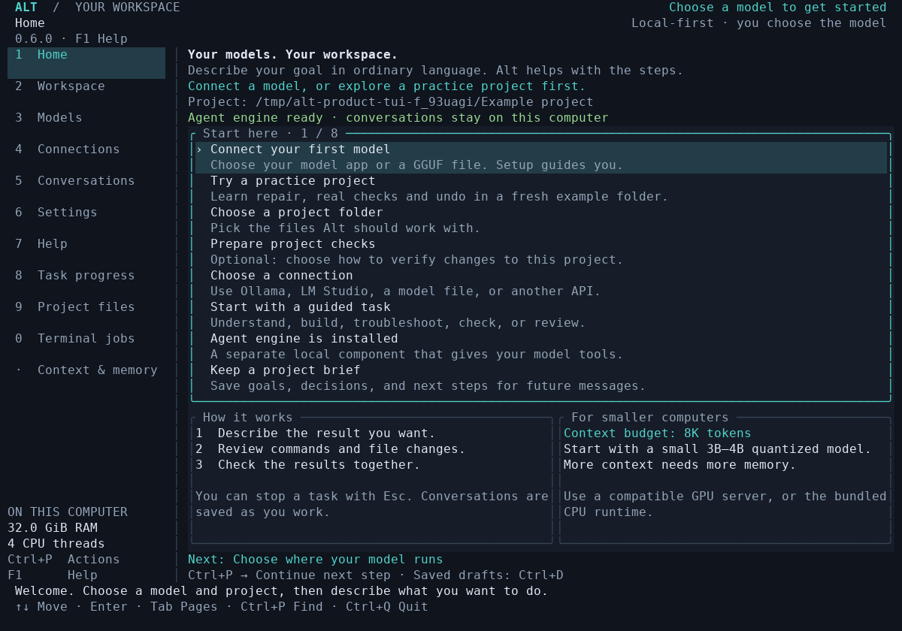

# Alt: launch and final UX walkthrough

The following captures record the launch walkthrough before the appearance pass.
For the current Home design and customization controls, see
[Themes, layouts and screenshots](APPEARANCE.md).

The product is **Alt**, the installed command is **`alt`**, and the repository and
package are **Alt CLI** (`alt-cli`). Type the word `alt` and press Enter in a real
terminal. Home opens before you configure a model; **Ctrl+Q** saves drafts and
exits. Linux x86_64 is the current packaged target.

These changes belong to the final-pass source branch, not the published beta 3.
See [Installation](INSTALLATION.md) and the branch's GitHub Actions artifacts.

## What you see

The actual startup frame appears before opening settings, saved conversations and
drafts. It proceeds immediately when that work completes. There is no minimum
splash delay, fake percentage, model download or automatic connection on launch.
The capture held an actual SQLite lock briefly, then released it and checked that
Home opened and the terminal restored on exit.

These are observed PTY buffers rendered to PNG by `terminal_capture.py`. They
come from the running Rust application, with a weight-free test engine selected.
The displayed hardware is the cloud computer. They do not depict a live model
answer or measure the owner's GTX 1070. Text captures and binary hashes accompany
the [test evidence](evidence/ux-finalization-2026-10-08/).

## Changes from the walkthrough

- Home adapts to 120×40, 80×24 and the supported minimum of 60×18. Compact lists
  show their selection count and retain project and next-step guidance.
- Navigation follows keyboard focus all the way to Context & memory. Sidebar
  mouse targets no longer overlap in shorter windows. Tab or Shift+Tab focuses
  navigation; arrows choose a page and Enter opens it.
- **Ctrl+P** exposes setup, model acquisition, files, terminal jobs, checks and
  settings. Form-only actions stay in their forms. Empty searches explain how
  to recover. Actions that open results also open the relevant page.
- Mouse wheels scroll lists and pickers without activating settings or wrapping
  at the end. The smallest folder picker keeps Cancel readable. Compact Home
  hints open the action they describe.
- The first-run guide connects a model, chooses a project and prepares the engine.
  Project checks are optional for beginning a conversation. Practice projects
  remain available directly from Home and search.
- Help explains copying, pasting, mouse capture, ordinary and abliterated model
  choices, and recovery. Full build identity is in **Help → About Alt** and
  `alt build-info`; the header shows the package version.
- Installer success explains `alt`, checks whether PATH reaches this installation,
  identifies a shadowing executable, and prints quoted Bash/zsh/Fish guidance.
  Custom state paths remain in the suggested launch command. No shell startup
  files are modified automatically.
- API key fields reject invalid environment-variable names before saving.
  Missing/non-Unicode lookup errors do not echo the field or environment value.
  Keys still come from environment variables; this is not an OS credential vault.

## Validation scope

The final local Rust run passed **183 tests** (one existing opt-in longevity test
ignored), with formatting and strict all-target Clippy clean. The final product
walkthrough passed **109 checks**, and the installer suite passed **12 tests**.
The clean Linux portable binary has the same application source fingerprint as
that tested build. Its installed TUI and all **eight package gates** passed,
including Debian 11, Ubuntu 24.04 and published beta 3 upgrade/rollback.
The screenshot-inclusive package was checked again after adding the offline
images. [GitHub verification](https://github.com/3d3dcanada/alt-cli/actions/runs/37768587588)
completed successfully after the original handoff; the counts above are the
recorded local cloud results for that earlier build.

The regression suite drives actual keyboard, paste, mouse and resize events in
pseudo-terminals. It visits all 11 pages by keyboard and mouse and opens all 17
Settings entries at three sizes. Separate journeys exercise first-run connection
setup, recoverable errors, drafts, permissions, edit/check/undo, terminal jobs,
practice projects, recovery, allowances and input pressure. Installer tests launch
the installed command through PATH and check terminal restoration.

The evidence records binary identities, commands, counts and failures found during
the pass. Earlier evidence under `final-pass-2026-10-08` remains unchanged.
The product journey is now part of `scripts/setup-cloud.sh`, so GitHub verification
will rerun it on subsequent source changes.

This validates specified journeys, not every possible combination of model,
terminal emulator, server version and configuration. Five uncoached novice
sessions and physical GTX 1070 testing remain open. Authenticated API setup still
requires setting an environment variable. A value shaped exactly like a valid
variable name cannot be identified reliably as a pasted token.

No model weights were trained, downloaded or benchmarked for this UX pass. The
previous matched uncensored-model pilot remains **1/4 baseline and 1/4 candidate**;
these interface changes are not evidence of stronger model reasoning. See
[qualification](FINAL_PASS_QUALIFICATION.md) for model and hardware limits.
