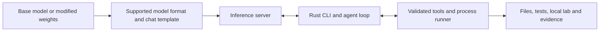
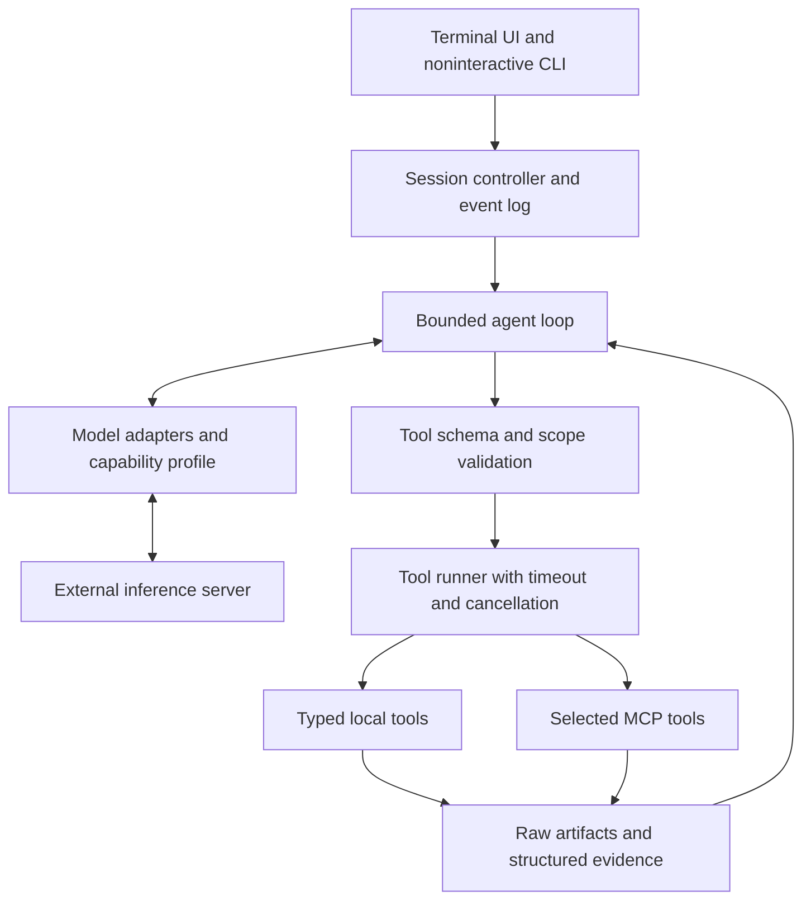

# Models, serving backends, and small-model design

**October 5, 2026.** These are research findings and proposed design choices. No model was executed in this phase. The user subsequently confirmed Linux, a GTX 1070 with 8 GB VRAM, and 16 GB RAM, with older-computer support as a priority. The initial target is an uncensored/abliterated 3–4B model; smaller models cover CPU/low-resource systems. All live prototype tests must use uncensored/abliterated artifacts. The [build plan](../BUILD_PLAN.md) incorporates these requirements and supersedes earlier unmodified-model test suggestions.

## The compatibility layers

“Abliterated” is the usual term for the weight-modification approach the user described. “Uncensored” is a description used by model publishers, not an API or file format. [Heretic][heretic] is a Python tool that modifies models; it is not an inference endpoint that the Rust CLI must call.

The practical chain is:

The CLI should accept arbitrary model identifiers and configurable endpoints. The inference server must support the model architecture, tokenizer, quantization, and chat template. A Heretic-produced derivative can normally follow its base family's serving path when these remain compatible, but that is a hypothesis to verify for each artifact, not a universal guarantee.

GGUF, Safetensors, and MLX artifacts are not interchangeable labels for the same runtime input. LoRA adapters may require loading with a base checkpoint or merging through a supported workflow. The CLI should consume a working endpoint first, rather than becoming a universal weight converter.

**Four different claims must stay separate:** a checkpoint loads; a server emits correctly formatted tool calls; the model chooses sensible tools; the entire task succeeds. Abliteration does not establish any of the latter three.

## Backend strategy

Start with a **Chat Completions adapter and an Ollama adapter**, using whichever the chosen base already implements. Keep OpenAI Responses separate for hosted models and servers that actually implement it. Preserve provider-specific settings through explicit profiles instead of assuming every OpenAI-compatible server accepts every parameter.

| Backend | Role in alt-cli | Evidence and limits |
|---|---|---|
| **llama.cpp / llama-server** | First reference backend for local GGUF, CPU and optional acceleration | [Function-calling docs][llama-tools] describe OpenAI-style tools with Jinja templates, native format handlers, and generic handling. [Grammar docs][llama-grammar] describe JSON Schema-to-grammar support with limitations. Useful for controlled experiments. |
| **Ollama** | Easy model management and a convenient local runtime | [Tool docs][ollama-tools] cover the tool round trip; [compatibility docs][ollama-api] describe supported OpenAI endpoints/fields. Model tags and templates need pinning; a friendly model tag alone is not reproducible evidence. |
| **LM Studio** | Desktop-user endpoint, including users who already manage their models there | Goose's [provider documentation][goose-providers] explicitly supports its local OpenAI-compatible server. Validate the installed version and selected model; this research did not audit LM Studio's full application or distribution license. |
| **vLLM** | Optional GPU/server backend and reproducible model-serving tests | Its [tool docs][vllm-tools] distinguish named/required calls, auto selection, parsers, and templates. Extra flags and the correct parser matter. More infrastructure than needed for the initial laptop target. |
| **SGLang** | Additional server backend through the compatible API | Official [Qwen serving instructions][qwen-current] include SGLang and model-family parser settings. Dedicated SGLang implementation inspection was not completed; verify its exact version before promising parity. |
| **MLX-LM / an MLX serving application** | Optional Apple Silicon route | [MLX-LM][mlx] explicitly targets Apple Silicon and Hub models. A Rust CLI can call a compatible server while the model runs in MLX; verify tool parsing in the chosen serving application. |
| **mistral.rs** | Optional Rust inference backend | [Project docs][mistralrs] describe OpenAI/Anthropic-compatible serving, structured tools, agentic execution, MCP, and GGUF support. Do not run both server-side and CLI-side tool orchestration for the same request accidentally. |
| **KoboldCpp** | Compatibility route for users already running local GGUF models in this ecosystem | Its [current README][koboldcpp] advertises OpenAI/Ollama-compatible endpoints and tool calling. Test the actual API and template; UI-level tool support alone does not prove the expected wire behavior. README declares AGPLv3 for the application, with exceptions for bundled components. |
| **Text Generation WebUI / textgen** | Additional user-managed model server | The [current README][textgen] documents multiple inference backends and OpenAI/Anthropic-compatible APIs with tool calling. Its Python UI and AGPL code are not required inside the Rust CLI; endpoint compatibility still needs testing. |
| **LocalAI** | Optional gateway across multiple inference engines | Its [README][localai] documents on-demand inference backends, compatible APIs, tools and MCP. Useful when users already operate it; unnecessary extra infrastructure for the first single-model experiment. |
| **Hosted GPT/Claude/Gemini or other providers** | Optional comparison or explicitly selected escalation | Use their actual APIs and supplied credentials. Hosted-model policies and available capabilities remain the provider's; a local CLI cannot turn a hosted model into an uncensored checkpoint. |

Keep inference outside the Rust CLI initially. This supports models served on another machine, avoids bundling multiple GPU stacks, and lets users keep their existing runtime. An embedded inference feature can be added later if a measured requirement justifies it.

“Any model” should mean **configurable backends and explicit capability handling**, not a promise that every model can execute tools. A useful compatibility result is: chat works; native tools work; constrained-action fallback works; or this workflow is unsupported. Missing support should have a concrete reason.

## Model shortlist

The list is a test queue, not a performance ranking. Hugging Face model IDs below come from model-author repositories. Direct Hub cards were blocked during initial research. The subsequent implementation pass inspected and pinned one [Heretic GGUF candidate](live-model-candidate.json); the remaining candidates still need artifact/license verification. No live model test has run.

| Model/family | Why test it | Proposed role and caveat |
|---|---|---|
| **Spark-X2.5-4B / 1.7B** | The [official repository][spark] documents these small sizes, tool/agent capabilities, hybrid attention and native context up to 1M; states Apache-2.0 | **Priority family for small-model/long-context research.** Verify a suitable uncensored derivative before live testing, and measure the real context budget on Pascal hardware. |
| **Xiaomi MiMo family** | User-requested addition. Official sources document [MiMo 7B][mimo], [MiMo-V2-Flash][mimo-flash] and current model offerings referenced by [MiMo-Code][mimo-code] | Keep in the discovery/integration queue. Sizes and delivery modes vary: V2-Flash is 309B total/15B active, whereas the earlier family is 7B. Current V2.5/X-preview names do not by themselves prove downloadable weights or hardware fit. Verify uncensored derivatives before live prototype tests. |
| **Qwen3-4B-Instruct-2507** | Official [Qwen3 repo][qwen3] documents the 4B instruct release, non-thinking mode, and tool use; Heretic's README also uses this family | Source-family reference for a corresponding uncensored derivative; the unmodified model is no longer the proposed live-test baseline. |
| **Qwen3.5-4B**, then **Qwen3.5-9B** | The current [Qwen repository][qwen-current] records the March 2026 small-model release, including 0.8B/2B/4B/9B, and local serving support | **Newer challengers.** Check backend architecture support, the checkpoint's tool template, and reasoning controls. The repository now covers newer Qwen generations too; do not copy a large-model serving example blindly. |
| **Qwen3-8B** | Documented small-to-medium dense model with a broad serving ecosystem | Useful larger baseline if memory permits. Compare against the 4B model under the same tool/context budget. |
| **A Heretic derivative of the chosen 4B family** | [Heretic's README][heretic] links `p-e-w/Qwen3-4B-Instruct-2507-heretic` | **Provisional live-test candidate**, subject to artifact/license/hardware verification. Compare compatible precisions or other verified uncensored derivatives. Do not treat testimonials as a benchmark. |
| **HuggingFaceTB/SmolLM3-3B** | Hugging Face's [official repository][smollm] describes a fully open 3B model, dual reasoning modes, and local execution | Smaller-footprint comparison. The inspected README is not enough to establish multi-step tool reliability; run the protocol and task tests. |
| **Granite 4.0 micro / h-micro** | IBM's [official repository][granite] explicitly demonstrates tool calls and structured JSON, and states Apache-2.0 for its models | Alternative family to reduce Qwen-only assumptions. Verify each variant's actual parameter/memory budget and backend support; the labels alone are insufficient. |
| **Salesforce xLAM-2-1b-fc-r / xLAM-2-3b-fc-r** | The [author repository][xlam] lists 1B/3B multi-turn function-calling variants and GGUF links | Specialized tool-selection experiments. Code, datasets, and weights have different terms: the repo states Apache code and CC-BY-NC data and also uses research-only language. Review the actual model card before product use. |
| **FunctionGemma 270M** | The inspected [vLLM documentation][vllm-tools] has a dedicated parser and describes task-specific fine-tuning | A possible specialist dispatcher experiment, **not** the initial general reasoning model. Direct author model-card review is pending. |
| **gpt-oss-20b** | [OpenAI's source repo][gptoss] documents tool use, Harmony, Apache-2.0, and an approximately 16 GB MXFP4 memory target | Optional higher-memory comparison. Its 3.6B active parameters do not make it a 3.6B-storage model: the author reports 21B total parameters. Not the default for a low-memory laptop. |

Useful Hub follow-ups: [Qwen3 4B Instruct](https://huggingface.co/Qwen/Qwen3-4B-Instruct-2507), [Qwen3.5 4B](https://huggingface.co/Qwen/Qwen3.5-4B), [Heretic derivative](https://huggingface.co/p-e-w/Qwen3-4B-Instruct-2507-heretic), [SmolLM3](https://huggingface.co/HuggingFaceTB/SmolLM3-3B), [Granite micro](https://huggingface.co/ibm-granite/granite-4.0-micro), [xLAM 3B](https://huggingface.co/Salesforce/xLAM-2-3b-fc-r). **These links were not directly verified in this session.**

## What abliteration changes in our evaluation

Heretic describes optimizing refusal reduction while limiting KL divergence from the original model. Lower divergence is an optimization objective; it is not a direct test of tool selection, code correctness, or penetration-testing competence.

For current live tests, compare verified uncensored/abliterated artifacts with matched tokenizer/template, tool set, quantization target, context window, prompt, and budgets. Record refusal behavior separately from correctness. An original-versus-modified comparison is a possible later experiment only if the user changes the current testing requirement. A variant that refuses less but invents arguments or fabricates findings may be worse for this product.

Where available, compare unquantized or higher-precision artifacts before interpreting a low-bit failure as an abliteration effect. If only a community GGUF is available, capture its upstream model revision, conversion method, quantization, and template provenance. Avoid confounding a weight modification with a different conversion or prompt.

The CLI should not hardcode names such as `uncensored`, `heretic`, or `abliterated` to determine capability. They are metadata at most. Operational capability comes from a tested model/server/profile combination.

## Making small models more effective

The following are engineering hypotheses and defaults to test, not universal performance claims.

1. **Expose a small tool set.** Begin with roughly 4–8 tools relevant to the current workflow. Load additional MCP groups only when needed. A huge catalog consumes context and creates similar-looking choices.
2. **Prefer typed operations for repeated tasks.** Give the model `search_files`, `read_file`, `run_tests`, `http_request`, and structured scan/report operations. Retain a shell escape hatch for tasks outside those wrappers, with clear process limits.
3. **Make one bounded decision at a time.** Default to sequential calls for the initial 4B profile. Deterministic code can perform parallel independent subprocess work inside a tool. Only enable model-directed parallel calls after measuring them.
4. **Use native tool calls when they work.** Constrained JSON/action envelopes are a fallback. Goose's interpreter shim is another experiment, with extra inference cost. Avoid interpreting arbitrary prose as a shell command.
5. **Validate every call in the runner.** Check schema, required fields, registered name, path/target scope, and resource limits before executing. Constrained decoding helps output syntax; it does not make the chosen action correct. vLLM's documentation explicitly makes that distinction.
6. **Return useful structured results.** Include status, exit code, concise stdout/stderr excerpts, parsed findings, and a raw-artifact reference. A successful process exit is not necessarily a successful test or a confirmed vulnerability.
7. **Keep evidence outside the prompt.** Preserve full logs as artifacts and send the model the relevant excerpt. Keep objective, scope, current findings, and pending actions in explicit session state. Summaries must not invent success or erase failure evidence.
8. **Use small, explicit budgets.** A starting experiment is 8k context, a short output budget, around 12 model turns, one corrective retry for malformed arguments, and per-tool timeouts. Increase only when a measured task needs it. These are proposed values, not validated optimal settings.
9. **Distinguish error types.** Bad schema, missing program, network error, empty result, unsupported API field, refusal, and exhausted budget need different recovery paths. Do not retry a non-idempotent operation just because a stream disconnected.
10. **Measure a stronger model only as an explicit option.** If users choose an 8–9B or hosted escalation, record the switch. The core workflow should remain useful with the selected local model.

[Qwen-Agent][qwen-agent] is valuable reference code because its instructions distinguish its own tool parsing from server-side parsing and vary the strategy by model family. [Hugging Face smolagents][smolagents] is useful for compact agent design and comparison between code actions and conventional tool calls. Both are Python projects, so they are references and benchmark controls rather than the primary Rust base. smolagents' own documentation says its local Python executor is not a security sandbox.

## Proposed Rust-side architecture

Keep model adapters separate from tool adapters. **MCP standardizes the tool connection; it does not supply inference, improve reasoning automatically, or isolate a process.** Its value here is reusing tool integrations without bloating the model's active tool catalog.

A profile should capture at least: backend kind, endpoint, model ID/revision, server version, context limit, native-tool support, JSON-schema support, streaming behavior, parallel-call support, reasoning/template controls, timeouts, and sampling settings. Probe protocol behavior with harmless tools, then validate task behavior. `/models` listing alone proves neither.

For security-testing workflows, explicit target scope and process controls serve the operator independently of a model's refusal behavior. Preapproved local tool profiles can avoid repeated interruptions while keeping commands bound to the intended project/lab. Record tool name, validated arguments, process result, artifact hashes, and the evidence supporting each finding. Documents and command output are untrusted input to the agent, including text that looks like instructions.

Start with code inspection, test execution, local HTTP checks, and existing analyzers such as Semgrep or dependency scanners behind structured wrappers. Add specialized scanner integrations only when there is a concrete workflow to validate. The model should interpret evidence, not fabricate an assertion that a scanner ran.

## Memory and performance assumptions

At an idealized four bits per parameter, weights alone require about **1.5 GB for 3B**, **2 GB for 4B**, **4 GB for 8B**, and **4.5 GB for 9B** parameters, in decimal GB. Actual artifacts include quantization metadata and often mixed-precision tensors; execution also needs runtime buffers, caches/state, and tool processes. These numbers are lower-bound arithmetic, not hardware requirements.

Context length can materially change memory and prompt-processing time. A model advertising 128k or 256k context is not a reason to allocate that context on a laptop. Start with a smaller measured budget. Report time to first useful action and successful task latency, not just tokens per second.

Use the GTX 1070/8 GB VRAM/16 GB RAM Linux configuration as the reference target, with a Pascal-compatible inference engine and CPU fallback. The first benchmark should also record the actual CPU, driver, acceleration path, quantization, free memory and configured context. Advertised context sizes and measurements on newer RTX hardware are not proof of performance on the 1070.

## Remaining direct Hugging Face work

When Hub access becomes available, inspect the shortlisted model cards, license files, `config.json`, tokenizer configuration, chat templates, quantized artifact inventories, and revision hashes. Compare base and derivative metadata, verify required custom model code, and use trusted/pinned artifacts. Check any claimed tool benchmark's task set and serving configuration rather than relying on a leaderboard headline.

No new Hugging Face credential was requested: the observed issue was network access, not a failed authenticated operation. Public card research should not require a token. The saved network additions need review/save and environment publication through the product; runtime access and fresh-task behavior remain unverified.

[heretic]: https://github.com/p-e-w/heretic/blob/208c0ca35b3feade91dc74755cb80b529affa325/README.md
[llama-tools]: https://github.com/ggml-org/llama.cpp/blob/50569eb87df530daff11afda229ceb9ab8e6cae8/docs/function-calling.md
[llama-grammar]: https://github.com/ggml-org/llama.cpp/blob/50569eb87df530daff11afda229ceb9ab8e6cae8/grammars/README.md
[ollama-tools]: https://github.com/ollama/ollama/blob/e363843b834c9aed95f3a9a7363adbb11d6a1444/docs/capabilities/tool-calling.mdx
[ollama-api]: https://github.com/ollama/ollama/blob/e363843b834c9aed95f3a9a7363adbb11d6a1444/docs/api/openai-compatibility.mdx
[goose-providers]: https://github.com/aaif-goose/goose/blob/7debb275d36559ee4e81799362e7f638275dfed3/documentation/docs/getting-started/providers.md
[vllm-tools]: https://github.com/vllm-project/vllm/blob/0eac15270710ddb7f5296d7244fcd0496c2daa0f/docs/features/tool_calling.md
[mlx]: https://github.com/ml-explore/mlx-lm/blob/5cfec4cb39deba54210b3ff4d86f2337c7bc10b5/README.md
[mistralrs]: https://github.com/EricLBuehler/mistral.rs/blob/3f2515e9b5adc2ac44949c128c50a13b15721294/README.md
[qwen3]: https://github.com/QwenLM/Qwen3/blob/7a2f61ffc7a20d47efcd2bf97f6f2bf52729042e/README.md
[qwen-current]: https://github.com/QwenLM/Qwen3.5/blob/2ea10dc725823bf7c3e21ce8557cbe15245132ae/README.md
[smollm]: https://github.com/huggingface/smollm/blob/438be18dae658a638f3a6976fdf5190bb6d68619/README.md
[granite]: https://github.com/ibm-granite/granite-4.0-language-models/blob/de23701d1627c767cfc91a0ccfa360a5b247dde2/README.md
[xlam]: https://github.com/SalesforceAIResearch/xLAM/blob/a88aa3aeddbc2d7d6aa7a87687d1a085c34e2aec/README.md
[gptoss]: https://github.com/openai/gpt-oss/blob/7b583341fe16729127f6d5b94a7b09ccae97e1a1/README.md
[qwen-agent]: https://github.com/QwenLM/Qwen-Agent/blob/31a4d36d123688581a9e9744427272b33ce940e0/README.md
[smolagents]: https://github.com/huggingface/smolagents/blob/c30b115286e000e98711fae5e85993547b73d826/README.md
[koboldcpp]: https://github.com/LostRuins/koboldcpp/blob/f9a32456edd3e5bc5fd6327fb1a370d647a2bff5/README.md
[textgen]: https://github.com/oobabooga/text-generation-webui/blob/c93f8871239550de2ccfe1e95d469aa82616f07e/README.md
[localai]: https://github.com/mudler/LocalAI/blob/68c980f3cd4edd778c87159866d87736f9fdb989/README.md
[spark]: https://github.com/XHToken/Spark-X2.5/blob/a24ca4e6366f60b8e14211af50dfbd75d089be5c/README.md
[mimo]: https://github.com/XiaomiMiMo/MiMo/blob/3a3fe65e6081c9f340ff0d24d82c4d7a96a247c5/README.md
[mimo-flash]: https://github.com/XiaomiMiMo/MiMo-V2-Flash/blob/b4eaae40d3728657ff7f0f9397dcce3c9ab3d3b7/README.md
[mimo-code]: https://github.com/XiaomiMiMo/MiMo-Code/blob/6babeb0b98f9b4818bddf04a4331edfee04dbf85/README.md
