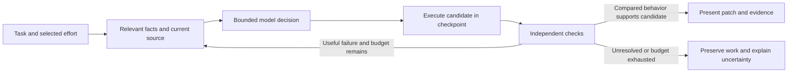

# Proposed reasoning work orders for Alt

**October 7, 2026. Design proposal; no implementation or new evaluation results.**
Read [the reasoning review](2026-10-07-small-model-reasoning.md) for evidence and
limitations. These orders extend the existing
[SM-01–12 harness proposal](2026-10-07-small-model-experiments.md), rather than
claiming a second already-built feature set.

## Architecture to test

Keep a Rust controller around the replaceable engine. Give the selected model an
immediate decision, bounded evidence and an effort allocation. Collect its actual
action, execute with the chosen access policy, preserve the resulting observations,
and evaluate the candidate against declared checks.

The same loaded model can serve serial decision stages. Role names do not create
additional intelligence; the benefit needs to come from clearer questions, better
facts or independent verification. Preserve Full access, arbitrary user-selected
integrations, the external endpoint and exact selected model. An effort profile
changes the workflow's time/compute allocation, not global permissions.

## Eight work orders

| Order | Deliverable | Connection to existing proposal | Primary comparison |
|---|---|---|---|
| RE-01 | Effective reasoning/output accounting | SM-01 | Thinking off versus supported bounded thinking, with action headroom |
| RE-02 | Short evidence-driven decision packets | SM-04–06 | Existing interaction versus compact immediate decisions at equal prompt/compute budget |
| RE-03 | Verified serial candidate search | SM-09 | One repair versus two/three candidates under equal total effort |
| RE-04 | Adaptive effort and stopping | SM-01/04/09 | Fixed effort versus signal-driven effort with the same total allowance |
| RE-05 | Reasoning-derivative qualification | Model profile/catalog work | Exact selected baseline versus explicit candidate model, clearly a model change |
| RE-06 | Reviewed trajectory corpus and concise/mixed SFT | SM-11 | Same student before/after training, plus short/mixed/long data ablations |
| RE-07 | Tool-aware distillation and verified-reward RL | SM-11 | SFT versus SOD/OPD/RL, with training and inference costs reported |
| RE-08 | Search/PRM/latent research adapters | SM-07–12 where applicable | External research controls after simpler approaches establish a baseline |

### RE-01: reasoning must leave room for actions

Capture model artifact/tokenizer/template hashes, runtime and engine versions,
native tool/parser format, sampling, context, total generation, thinking controls,
the transmitted request and the runtime's accounting response. Record settings
that are unsupported, silently ignored, truncated or unavailable.

For Spark retain thinking-off as a baseline. Candidate allocations to screen are
0/256/512/1,024 thinking tokens, using provider-enforced controls where supported.
Keep sufficient output for an actual tool call. The initial comparison should
hold total output/time constant; a second frontier experiment can vary total
allowance explicitly. No single setting is assumed optimal.

Count prompt, reasoning, visible action/answer and tool-result tokens separately
where observable, and retain an honest unknown field otherwise. Do not use string
length as tokenizer counts. Do not subtract a hidden thought budget twice.
Check native tool replies, empty final answers, length stops, partial argument
JSON and cancellation during reasoning. Do not put a broken/truncated action on
the success path.

Qwen Instruct-2507 cannot be treated as a thinking-toggle experiment. A change to
Thinking-2507 is a distinct checkpoint comparison. Template-only controls cannot
teach an untrained model a new capability.

### RE-02: factual state and small decisions

Define a proposed host-owned record with:

- User goal, currently relevant requirement and immediate question.
- Source revision, bounded code/document excerpts and their provenance.
- Observed result, check identifier and raw evidence reference.
- Candidate hypothesis, unresolved question and next discriminating operation.
- Remaining time, candidate and inference allowance.

Observed facts and model hypotheses are separate fields. A hypothesis cannot
become an observation merely by surviving a summary or restart. After a source
change, invalidate stale excerpts and re-run revision-dependent checks. Failures
to obtain evidence stay visible.

Compare a concise decision packet against the current prompt on tasks requiring
real diagnosis, not only formatting. Include cases where decomposition chooses
the wrong subproblem or misses a cross-file dependency. Carry verified sub-results
forward, while checking whether their assumptions still hold.

Novices should see host-generated progress such as “Checking this change” and the
actual unresolved issue. They should not have to prompt the model to poll a test
or interpret its unsupported declaration of success.

### RE-03: candidates are real source states

Store an isolated snapshot for each proposed repair, with initial/final source
hashes, diff, ancestry, actual checks, timings and final disposition. Never mix
the tool output from one candidate with another's source. Retain undo and user
edits. Candidate collection must be cancellable and resumable without assuming
completed evidence for an interrupted check.

Run candidates sequentially on the reference design. Begin with at most two or
three and a shared total compute/time limit. Ask for a genuinely different
hypothesis after failure; a repeated identical patch is not useful diversity.
An additional candidate's setup, tools, retrieval and judgment are charged to
the same budget.

Selection uses declared independent checks. Add permitted discriminating inputs
only when their expected behavior is justified by a trusted contract/reference
or reviewed property. Distinguish “these candidates behave differently” from
“this candidate is correct.” Preserve uncertainty if checks are insufficient.

Fixture cases should cover colliding hash values, valid empty/`None` data, date
boundaries, configuration output contracts, duplicate symbols, changed source,
unsupported tool results, test deletion and forged completion text. Known Alt
counterexamples become development checks in a new oracle version. Add genuinely
new unseen task families for final confirmation.

### RE-04: effort should respond to evidence

Start with a simple host policy: direct/short decision for an easy observed step;
bounded reasoning for a remaining decision; alternative candidate or retrieval
when a concrete failure suggests it. Actual passed checks, unresolved dependencies,
new information and repeated no-progress outcomes can guide allocation.

DART-style agreement is an optional comparison signal, not the correctness oracle.
Before adapting it, test empty drafts, failed normalization, equal wrong answers,
truncated reasoning, invalid equivalence and incompatible provider budgets. Never
label agreement or natural termination as verified success.

For any learned/LLM router, record the checkpoint, all router calls and resources.
Do not silently add a bigger or censored routing model. Compare the adaptive policy
with equal-budget fixed effort and a baseline with no extra probing; two cheap
drafts can themselves make an easy operation slower.

### RE-05: model candidates need both reasoning and tool qualification

Start with the exact existing Spark abliterated checkpoint. Then explicitly select
an allowed candidate for an additional model cohort: SmolLM3 abliterated is relevant
to native tools; DeepScaleR/VibeThinker derivatives are reasoning-specialist
comparisons; VibeThinker-3B Heretic `-fc` needs separate validation of its claimed
function-calling fine-tune. LFM and Nanbeige need their own runtime/template checks.

Verify artifact identity, derivative ancestry and applicable model terms. Test
reasoning, ordinary instruction following, multi-step native tool calls, argument
correctness, recovery, final-answer production and retained selected access policy.
Record grammar/parser fallbacks rather than pretending generic output is native.

The upstream VibeThinker-3B card explicitly lacks tool-agent training. The
derivative's sparse fine-tuning card does not erase that qualification task.
Nanbeige's advertised search system includes another summarizer; the local cohort
must declare any replacement or absence of it. Q4/Q6/Q8 is a separate factor from
checkpoint/fine-tune choice.

No base checkpoint is used in a live test merely because its card was researched.
Every live model role must honor the owner's uncensored/abliterated requirement.

### RE-06: build a corpus before attempting training

Define a versioned trace schema recording the exact student/teacher, public task
contract, repository state, assistant decisions, real tool requests/results,
checks, failure/recovery transitions, tokenizer budgets and final correctness.
Keep source/license provenance, exclude secret/private content from distributable
data, and avoid training on sealed validation tasks.

The existing 23 historical frozen-check passes are not a complete training corpus;
some have known edge-case gaps. Review source correctness and broader checks before
promoting any trace. Failed attempts can supply accurate recovery examples, not
fictional successful repairs.

First compare concise teacher examples, mixed lengths/difficulty and a longer-trace
control at matched training budget. Include easy/medium tasks with reliable signals.
Preserve normal instruction/tool behavior while adding reasoning. Mask appropriate
user/tool observation tokens, and train actual assistant operations rather than
invented observations. Evaluate the same student checkpoint before and after SFT.

A prospective LoRA run needs a qualified hardware budget and a supported training
stack. Training in a modern GPU environment and later exporting a GGUF for local
inference are separate qualifications. Teacher inference is explicit and uses an
allowed checkpoint; it is not a hidden dependency of the exported student.

### RE-07: try heavier training only against a working SFT baseline

SOD's step-wise feedback offers a particularly relevant research direction for
small tool agents. Compare it with ordinary on-policy distillation and SFT using
the same student, permitted teacher, task mixture and held-out boundary. Record
teacher/student logprob access, rollout failures and all compute.

For RL, verify reward semantics before training: bad input, unparseable gold,
wrong answers, formatting-only answers, altered tests, timeout, no-op, partial
repair and incorrect “success” text. Invalid evaluation examples must be excluded
explicitly, with counts; they must not become rewarded completions. Check
correctness first, then efficient successful behavior. A shorter wrong output
must not win on a length reward.

Use Open-R1, veRL/rLLM or another justified training backend as an offline component.
Do not prescribe the published multi-GPU recipes for the GTX 1070. Review dataset
and output-model terms separately from framework code licenses. The inspected
Open-AgentRL dataset cards alone do not establish reuse/redistribution terms.

### RE-08: expensive research remains measurable and optional

Evaluate OptiLLM/ThinkBooster strategies individually, preserving exact model and
native-tool semantics. Count all generated branches, scoring calls and extra models.
A simulated-dialogue score is not a repository correctness reward. Use oracle
selection only as an explicitly labeled coverage upper bound in offline analysis.

Learned process verifiers, deep MCTS, adapters and latent reasoning require their
own model/runtime/hardware plans. Coconut and HRM/TRM are not ordinary skills
that can be loaded into arbitrary GGUF inference. Specialized solvers can be tools
when they solve a real task and their interface is independently checked.

## Measurement design

Preserve the old Alt evidence and oracle. Create a versioned suite that separates:

1. Tool-interface execution and recovery.
2. Algorithmic/boundary reasoning with supplied relevant facts.
3. Knowledge retrieval using the actual dependency/version.
4. Cross-file integration and general workflow reliability.

This helps identify whether a change improves reasoning, retrieval, editing,
verification or only formatting. Include baseline-success tasks to detect
regressions. Known historical held-out cases are now development material; final
validation must use new task families unseen during tuning.

A first screen can follow the existing proposal: 8 development tasks × 3 repeats
× 2 arms × 2 models = 96 attempts. It is exploratory. For RE-01, screen individual
budgets and then freeze a selected configuration before confirmation; do not run
every experimental feature at once and attribute the change to one.

Report two comparisons when extra inference is involved:

- **Equal total effort:** match total wall time and available compute as closely as
  possible; charge drafts, thinking, actions, verifiers, retrieval and retries.
- **Quality/resource frontier:** show whether extra time/calls buy enough success
  to be useful. Label changed allowances explicitly rather than claiming a free
  harness improvement.

Match exact weights, quantization, runtime, native parser, template, sampling,
context, initial task state, checks, feedback and access policy except the tested
factor. Use randomized/blocked execution order, paired seeds where available and
fresh snapshots. Seeds do not guarantee identical trajectories after prompt changes.
Do not remove timeouts, uncollected observations or invalid attempts from denominators.

Report independent task success, unsupported completion claims, first useful
action latency, invalid calls, unchanged source, regressions, cancellations,
user interventions and uncertainty grouped by task. Separately report:

- Single-candidate success (`pass@1` where applicable).
- Available correct-candidate coverage under a stated oracle, clearly offline.
- Actual selected-candidate success and the cost of selection.
- Repeated-sample average versus selected-best-of-k outcomes.

For training report held-out behavior, coverage/selection, normal capability
regressions, number of examples, tokens, GPU hours and teacher/data generation cost.
Measure exported quantized deployment separately from training-time evaluation.
No inference/training gain is claimed until these tests run.

## Novice-facing effort controls

A possible presentation, to test with actual users:

| Choice | Workflow behavior | User-visible evidence |
|---|---|---|
| Quick | One concise attempt with appropriate tools/checks | What ran and what remains unresolved |
| Careful | Bounded reasoning and a second candidate when useful | Progress, actual failures, selected patch and checks |
| Thorough | Up to three serial candidates under a displayed total budget | Alternatives, selection evidence and elapsed/resource cost |

These are proposed defaults, not implemented labels, quality guarantees or optimal
limits. Keep advanced settings available. Preserve drafts and completed work,
support cancellation/undo, and show actual progress from the host. Display extra
models/services and their resource cost whenever selected. An “effort” setting
should never silently change the model or claim unlimited reasoning.
